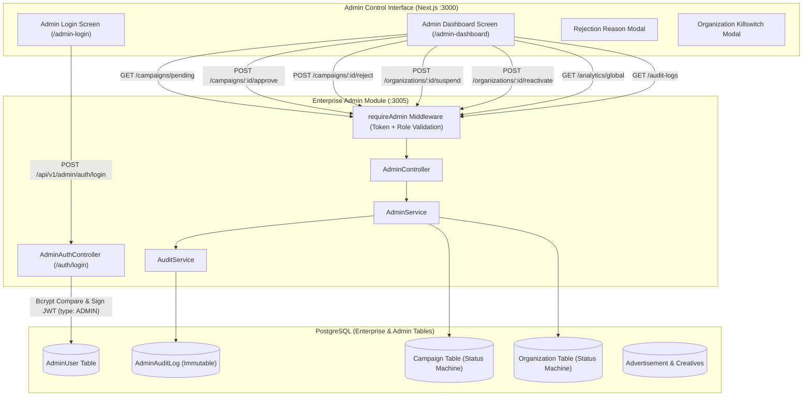
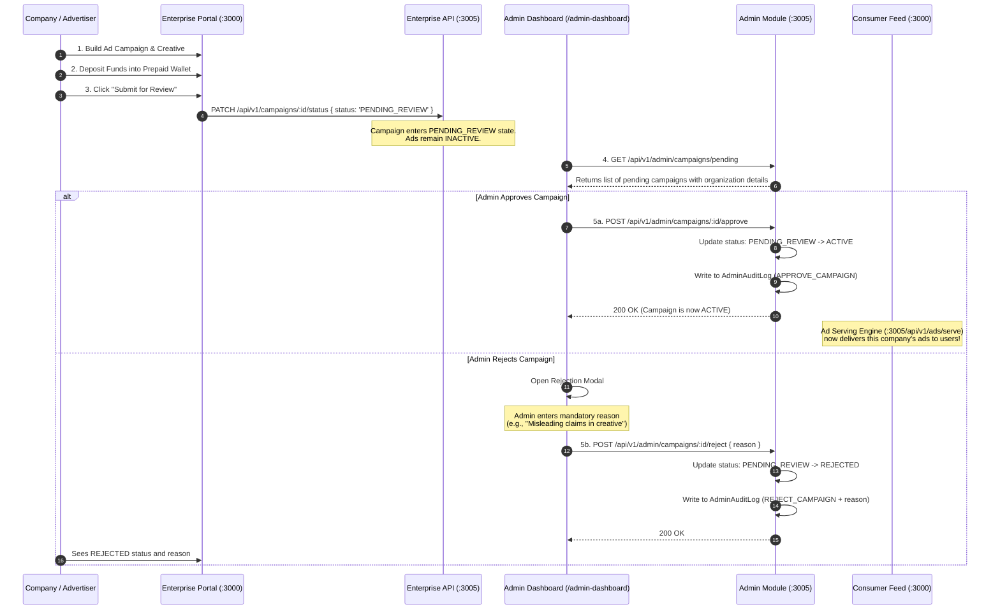
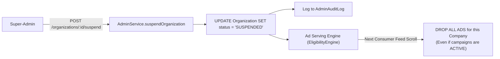

# GiniVibe Admin Control Plane & Company Ad Permission Governance — Architecture Guide

## 1. Executive Summary & Overview

The **Admin Control Plane** is GiniVibe's supreme administrative gatekeeper and platform governance system. While the **Enterprise Portal** allows external companies (brands, agencies, astrologers) to build ad campaigns and fund their prepaid wallets, **no company can serve an advertisement to users without explicit authorization from the Main Admin Control Plane**.

This subsystem enforces platform safety, regulatory compliance, brand quality control, and fraud prevention through a dedicated admin authentication system, multi-level Role-Based Access Control (RBAC), an interactive campaign approval pipeline, an organization killswitch (suspension), and append-only immutable audit logging.

The backend service runs inside `backend/microservices/enterprise/src/modules/admin` on **Port 3005**, while the frontend control interface lives in `frontend-web/app/(admin-portal)` at `/admin-login` and `/admin-dashboard`.

---

## 2. High-Level Architecture



---

## 3. Strict Identity Separation (Admin vs. Enterprise)

To eliminate privilege escalation risks, platform administrators **never share accounts, models, or tokens** with B2B enterprise tenants:

| Feature | Enterprise Users | Platform Administrators |
| :--- | :--- | :--- |
| **Database Table** | `EnterpriseUser` | `AdminUser` |
| **Login Endpoint** | `POST /api/v1/identity/login` | `POST /api/v1/admin/auth/login` |
| **Frontend Route** | `http://localhost:3000/enterprise` | `http://localhost:3000/admin-login` |
| **JWT Payload** | `{ id, email, organizationId }` | `{ id, email, role, type: 'ADMIN' }` |
| **Token Validity**| 24 hours | 12 hours (High-security rotation) |
| **Storage Key** | `localStorage['enterprise_token']` | `localStorage['admin_token']` |

### Platform Roles & Hierarchy (`PlatformRole`)
Defined in `backend/microservices/enterprise/prisma/schema.prisma`:

```prisma
enum PlatformRole {
  SUPER_ADMIN
  PLATFORM_ADMIN
  REVIEWER
  SUPPORT
}
```

* **`SUPER_ADMIN`**: Unrestricted platform authority. Can approve/reject ads, suspend/reactivate organizations, view global revenue analytics, and inspect immutable audit logs.
* **`PLATFORM_ADMIN`**: Full day-to-day administrative powers (approvals, suspensions, analytics).
* **`REVIEWER`**: Content moderation specialist. Can view the approval queue and approve or reject campaigns with reason codes. **Forbidden from suspending organizations or accessing audit logs.**
* **`SUPPORT`**: Customer service agent. Read-only access to view organization profiles to assist advertisers. **Forbidden from approving ads or taking destructive actions.**

---

## 4. How Companies Get Permission to Run Ads (The Approval Pipeline)

Advertisers cannot publish ads directly. All ads undergo mandatory human moderation through the following end-to-end lifecycle:



### State Machine Enforcement
The Enterprise API strictly enforces valid state transitions:
* Advertisers can only set: `DRAFT -> PENDING_REVIEW` or `ACTIVE -> PAUSED`.
* Advertisers **cannot** transition any campaign directly to `ACTIVE`.
* Only the Admin Module (`AdminService.approveCampaign`) has permission to transition a campaign from `PENDING_REVIEW` to `ACTIVE`.

---

## 5. Company Killswitch: Organization Suspension & Reactivation

If a company violates community standards, attempts fraud, or experiences billing issues, administrators can trigger an immediate platform-wide **Killswitch**:



### Mechanics of the Suspension Killswitch:
1. **1-Click Execution:** The admin clicks "Suspend" next to the organization in the Admin Dashboard.
2. **Modal Confirmation:** A custom modal confirms the action to prevent accidental suspensions.
3. **Database Mutation:** The organization's status is atomically set to `SUSPENDED`.
4. **Instant Ad Termination:** The Ad Serving Engine (`backend/microservices/enterprise/src/modules/ads/services/eligibility.service.ts`) queries the organization status. When an organization is `SUSPENDED`, **all candidate ads belonging to that organization are immediately excluded from consumer feeds across the entire network**.
5. **Reactivation:** Administrators can click "Reactivate" to restore the organization to `ACTIVE`, automatically resuming previously approved ad inventory.

---

## 6. Immutable Security Audit Logging (`AdminAuditLog`)

Every administrative intervention is captured in an append-only audit trail to maintain accountability and compliance.

* **File:** [`backend/microservices/enterprise/src/modules/admin/services/audit.service.ts`](file:///home/amandeep/Documents/GiniVibe-Astrology-Backup/backend/microservices/enterprise/src/modules/admin/services/audit.service.ts)

### Data Captured per Action:
```typescript
await AuditService.logAction(
  adminId,                  // UUID of the authenticated admin
  'APPROVE_CAMPAIGN',       // Action type
  'Campaign',               // Resource type
  campaignId,               // Resource ID
  { 
    previousState: 'PENDING_REVIEW', 
    newState: 'ACTIVE' 
  },                        // JSON diff snapshot
  campaign.organizationId   // Affected tenant organization
);
```

### Logged Actions:
* `APPROVE_CAMPAIGN`: Approving an ad campaign to go live.
* `REJECT_CAMPAIGN`: Rejecting an ad campaign with justification reason.
* `SUSPEND_ORGANIZATION`: Triggering the company killswitch.
* `REACTIVATE_ORGANIZATION`: Restoring an organization's ad permissions.

Administrators can review historical audit logs with timestamps, admin emails, and action diffs under the **Audit Logs** tab on the dashboard.

---

## 7. Global Network Analytics

The admin dashboard aggregates high-level telemetry across **all** enterprise companies on the platform:

* **File:** [`backend/microservices/enterprise/src/modules/admin/services/admin.service.ts`](file:///home/amandeep/Documents/GiniVibe-Astrology-Backup/backend/microservices/enterprise/src/modules/admin/services/admin.service.ts)
* **Endpoint:** `GET /api/v1/admin/analytics/global`

### Aggregated Metrics:
* **Total Ad Revenue:** Lifetime revenue accrued from impressions (₹0.01 per impression) and clicks (₹2.00 per click) across all companies.
* **Network Impressions:** Cumulative volume of ads served to consumers.
* **Network Clicks:** Total consumer engagements across all placements.
* **Active Campaigns Count:** Real-time count of approved campaigns currently running.

---

## 8. Frontend Web Implementation

The Admin Portal is housed under the route group `frontend-web/app/(admin-portal)`:

### 1. Admin Login Screen (`/admin-login`)
* **File:** [`frontend-web/app/(admin-portal)/admin-login/screens/AdminLoginScreen.tsx`](file:///home/amandeep/Documents/GiniVibe-Astrology-Backup/frontend-web/app/%28admin-portal%29/admin-login/screens/AdminLoginScreen.tsx)
* Styled with a dark/crimson security aesthetic and a `ShieldAlert` icon.
* Authenticates against `POST /api/v1/admin/auth/login` and stores the resulting token in `localStorage['admin_token']`.

### 2. Admin Dashboard Screen (`/admin-dashboard`)
* **File:** [`frontend-web/app/(admin-portal)/admin-dashboard/screens/AdminDashboardScreen.tsx`](file:///home/amandeep/Documents/GiniVibe-Astrology-Backup/frontend-web/app/%28admin-portal%29/admin-dashboard/screens/AdminDashboardScreen.tsx)
* **Sidebar Navigation:**
  * **Approval Queue:** Displays pending campaigns with a real-time red badge counter. Offers 1-click "Approve" and "Reject" triggers.
  * **Enterprise Organizations:** Displays all onboarded companies, member counts, and active campaign tallies, with "Suspend" and "Reactivate" toggle buttons.
  * **Global Analytics:** 4 KPI cards detailing network revenue, impressions, clicks, and running campaigns.
  * **Security Audit Logs:** Chronological table displaying all logged admin interventions.
* **Custom React Confirmation Modals:**
  * Uses internal React state modals instead of browser-native `window.confirm()` or `window.prompt()`, ensuring compatibility even in privacy-restricted browser environments (such as Chrome Incognito).

### 3. Frontend API Service Layer (`AdminAuth.ts`)
* **File:** [`frontend-web/app/core/services/AdminAuth.ts`](file:///home/amandeep/Documents/GiniVibe-Astrology-Backup/frontend-web/app/core/services/AdminAuth.ts)
* Provides strongly-typed wrapper methods for all admin API endpoints with bearer token injection.

---

## 9. Database Schema Reference

```prisma
enum PlatformRole {
  SUPER_ADMIN
  PLATFORM_ADMIN
  REVIEWER
  SUPPORT
}

model AdminUser {
  id        String       @id @default(uuid())
  email     String       @unique
  password  String
  firstName String?
  lastName  String?
  role      PlatformRole @default(REVIEWER)
  createdAt DateTime     @default(now())
  updatedAt DateTime     @updatedAt

  auditLogs AdminAuditLog[]
}

model AdminAuditLog {
  id             String   @id @default(uuid())
  adminId        String
  action         String
  resourceType   String
  resourceId     String
  organizationId String?
  metadata       Json?
  ipAddress      String?
  userAgent      String?
  createdAt      DateTime @default(now())

  admin AdminUser @relation(fields: [adminId], references: [id])
}

enum OrganizationStatus {
  ACTIVE
  SUSPENDED
}

enum CampaignStatus {
  DRAFT
  PENDING_REVIEW
  ACTIVE
  PAUSED
  COMPLETED
  CANCELLED
  REJECTED
}
```

---

## 10. API Specification Reference

All administrative endpoints require the `Authorization: Bearer <admin_token>` header.

| Method | Route | Allowed Roles | Description |
| :--- | :--- | :--- | :--- |
| `POST` | `/api/v1/admin/auth/login` | Public | Admin login, returns admin token |
| `GET` | `/api/v1/admin/campaigns/pending` | `SUPER_ADMIN`, `REVIEWER`, `PLATFORM_ADMIN` | List campaigns awaiting review |
| `POST` | `/api/v1/admin/campaigns/:id/approve` | `SUPER_ADMIN`, `REVIEWER`, `PLATFORM_ADMIN` | Approve campaign to go `ACTIVE` |
| `POST` | `/api/v1/admin/campaigns/:id/reject` | `SUPER_ADMIN`, `REVIEWER`, `PLATFORM_ADMIN` | Reject campaign with reason |
| `GET` | `/api/v1/admin/organizations` | `SUPER_ADMIN`, `PLATFORM_ADMIN`, `SUPPORT` | List all companies & statuses |
| `POST` | `/api/v1/admin/organizations/:id/suspend` | `SUPER_ADMIN`, `PLATFORM_ADMIN` | Suspend company & halt all ads |
| `POST` | `/api/v1/admin/organizations/:id/reactivate` | `SUPER_ADMIN`, `PLATFORM_ADMIN` | Restore company to active |
| `GET` | `/api/v1/admin/analytics/global` | `SUPER_ADMIN`, `PLATFORM_ADMIN` | Global platform ad revenue & metrics |
| `GET` | `/api/v1/admin/audit-logs` | `SUPER_ADMIN`, `PLATFORM_ADMIN` | View immutable action audit logs |

---

## 11. Developer Runbook & Seeding

### Default Admin Credentials
When seeded, the default Super-Admin account is:
* **Email:** `admin@ginivibe.com`
* **Password:** `supersecret`
* **Role:** `SUPER_ADMIN`

### Seeding an Admin User
```bash
cd backend/microservices/enterprise
npx ts-node seed-admin.ts
```

### End-to-End Verification via cURL

```bash
# 1. Login as Admin
curl -X POST http://localhost:3005/api/v1/admin/auth/login \
  -H "Content-Type: application/json" \
  -d '{"email": "admin@ginivibe.com", "password": "supersecret"}'

# (Copy the returned token)

# 2. View Pending Campaigns
curl -X GET http://localhost:3005/api/v1/admin/campaigns/pending \
  -H "Authorization: Bearer <ADMIN_TOKEN>"

# 3. Approve a Campaign
curl -X POST http://localhost:3005/api/v1/admin/campaigns/<CAMPAIGN_ID>/approve \
  -H "Authorization: Bearer <ADMIN_TOKEN>"

# 4. Suspend an Organization
curl -X POST http://localhost:3005/api/v1/admin/organizations/<ORG_ID>/suspend \
  -H "Authorization: Bearer <ADMIN_TOKEN>"

# 5. Check Immutable Audit Logs
curl -X GET http://localhost:3005/api/v1/admin/audit-logs \
  -H "Authorization: Bearer <ADMIN_TOKEN>"
```
