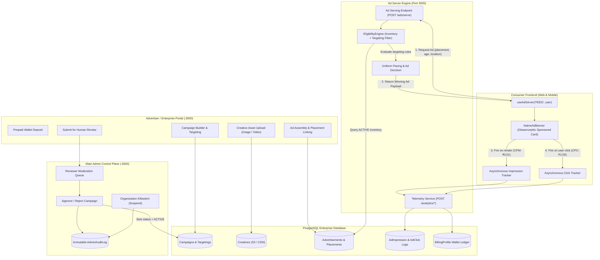
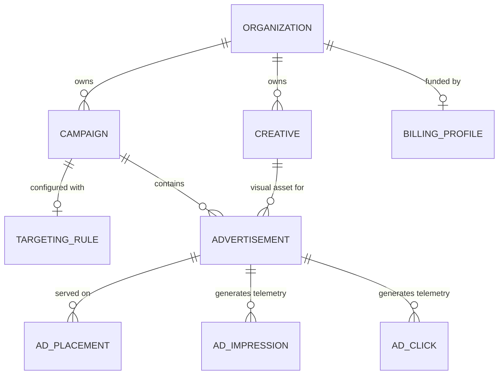
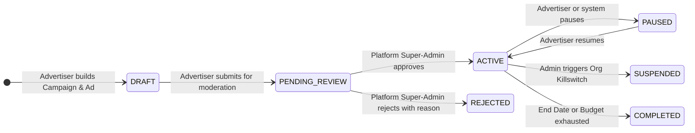
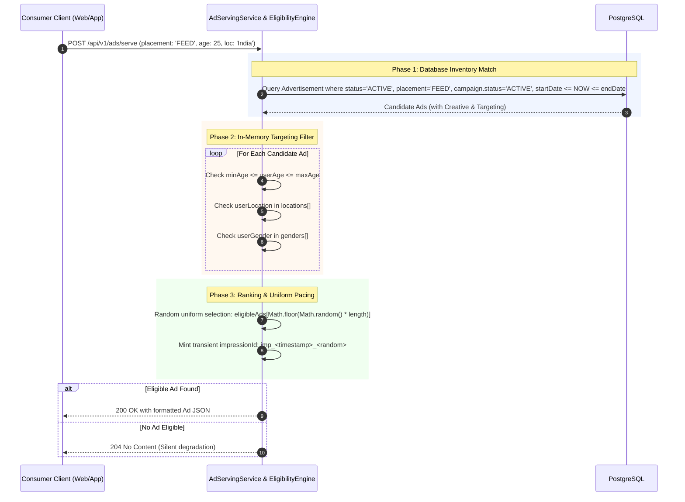

# GiniVibe Native Advertising Engine & Ad Network — Architecture & Operations Guide

## 1. Executive Summary & Overview

The **GiniVibe Native Advertising System** is an in-house, first-party Ad Serving, Target-Matching, and Telemetry Network integrated directly into the GiniVibe platform. Instead of relying on generic, privacy-invasive third-party ad networks (such as Google AdSense or AdMob), GiniVibe runs a dedicated **Ad Server** designed specifically for contextual lifestyle, astrological readings, spiritual guidance, and premium brand sponsorships.

The ad engine is implemented as a high-performance subsystem inside the **Enterprise Microservice** (`backend/microservices/enterprise`, running on **Port 3005**). It serves native sponsored content to both web (`frontend-web`) and mobile clients, tracks real-time impression and click telemetry, applies demographic and geographic targeting, and integrates with a prepaid wallet and Super-Admin safety governance pipeline.

---

## 2. High-Level Architecture

The ad subsystem spans three primary layers: **Advertiser/Enterprise Portal**, **Core Ad Server & Telemetry Engine**, and the **Consumer Client Interface**.



---

## 3. Core Database Entities & Data Models

All ad entities are managed via Prisma in [`backend/microservices/enterprise/prisma/schema.prisma`](file:///home/amandeep/Documents/GiniVibe-Astrology-Backup/backend/microservices/enterprise/prisma/schema.prisma) on PostgreSQL:



### Key Models Description

1. **`Organization`**: The top-level B2B tenant representing an advertiser, astrologer brand, or agency. Has an `OrganizationStatus` (`ACTIVE` or `SUSPENDED`).
2. **`BillingProfile`**: Contains the organization's prepaid wallet balance (`balance: Decimal`, `currency: 'INR'`).
3. **`Campaign`**: The organizational container for ad spend, objective, date range (`startDate`, `endDate`), and lifecycle status (`DRAFT`, `PENDING_REVIEW`, `ACTIVE`, `PAUSED`, `REJECTED`, `COMPLETED`).
4. **`TargetingRule`**: Defines constraints: `minAge`, `maxAge`, `locations: String[]`, `genders: String[]`, `interests: String[]`, and `devices: String[]`.
5. **`Creative`**: The media payload (`IMAGE` or `VIDEO`), `storageKey` (URL/S3 key), `headline`, `description`, `ctaText` (e.g., "Get My Reading"), and `destinationUrl`.
6. **`Advertisement`**: Joins a `Campaign` with a `Creative` and defines an individual ad unit with status (`ACTIVE`, `PAUSED`, `DRAFT`, etc.).
7. **`AdPlacement`**: Multi-placement selector (`FEED`, `EXPLORE`, `MATCHING`) bound uniquely per advertisement.
8. **`AdImpression`**: High-velocity telemetry row recording `advertisementId`, optional `userId`, `placementType`, timestamp, and `impressionCost` (₹0.01).
9. **`AdClick`**: Telemetry row recording `advertisementId`, optional `userId`, `placementType`, timestamp, and `clickCost` (₹2.00).

---

## 4. The 7-Stage End-to-End Ad Lifecycle



### Stage 1: Tenant Organization & Identity Registration
* External brands register via `POST /api/v1/identity/register` and create an organization via `POST /api/v1/organizations`.
* The creator is automatically assigned the `OWNER` role inside `OrganizationMember`.

### Stage 2: Wallet Pre-Funding
* Advertisers must pre-fund their account via `POST /api/v1/billing/funds`.
* Campaigns cannot serve without adequate balance in `BillingProfile`.

### Stage 3: Creative Asset Onboarding
* Creative media is uploaded via `POST /api/v1/creatives`:
  ```json
  {
    "name": "Daily Horoscope Promo",
    "mediaType": "IMAGE",
    "storageKey": "https://images.unsplash.com/photo-1532274402911-5a369e4c4bb5?w=800&q=80",
    "headline": "Unlock Your Cosmic Potential",
    "description": "Get a personalized astrology reading from top astrologers today.",
    "ctaText": "Get My Reading",
    "destinationUrl": "https://ginivibe.com/astrology"
  }
  ```

### Stage 4: Campaign Setup & Targeting Configuration
* Campaign created via `POST /api/v1/campaigns` with `budget`, `startDate`, and optional `endDate`.
* Demographic targeting rules attached via `PUT /api/v1/targeting/:campaignId` (specifying `minAge`, `maxAge`, `locations`, `genders`).

### Stage 5: Ad Assembly & Placement Binding
* Ad assembled via `POST /api/v1/ads` binding the `campaignId`, `creativeId`, and target placements (`["FEED", "EXPLORE"]`).

### Stage 6: Human Review Submission (Security Enforcement)
* **Crucial Security Guard:** Advertisers cannot activate campaigns directly.
* The advertiser submits via `PATCH /api/v1/campaigns/:id/status` with `status: "PENDING_REVIEW"`. Any attempt by an advertiser to set `ACTIVE` or `REJECTED` throws an immediate `403/400 Unauthorized Status Transition` error.

### Stage 7: Admin Moderation Gatekeeper
* Super-Admins view pending campaigns at `/admin-dashboard` via `GET /admin/campaigns/pending`.
* Super-Admin approves (`POST /admin/campaigns/:id/approve`) or rejects (`POST /admin/campaigns/:id/reject`).
* Approval sets `Campaign.status = 'ACTIVE'`, enabling it for the Ad Serving Engine.
* Every administrative decision is logged into the append-only `AdminAuditLog` table.

---

## 5. The Ad Serving Engine (`EligibilityEngine`) Deep Dive

* **File:** [`backend/microservices/enterprise/src/modules/ads/services/eligibility.service.ts`](file:///home/amandeep/Documents/GiniVibe-Astrology-Backup/backend/microservices/enterprise/src/modules/ads/services/eligibility.service.ts)
* **Serving Controller:** [`backend/microservices/enterprise/src/modules/ads/services/ad-serving.service.ts`](file:///home/amandeep/Documents/GiniVibe-Astrology-Backup/backend/microservices/enterprise/src/modules/ads/services/ad-serving.service.ts)
* **Endpoint:** `POST /api/v1/ads/serve` (Public high-throughput endpoint; requires no B2B authentication).

When a user browses GiniVibe, the client dispatches a targeting request to `/ads/serve`:

```json
{
  "placementType": "FEED",
  "userId": "usr_9981",
  "userAge": 25,
  "userGender": "Female",
  "userLocation": "India"
}
```

### The 3-Phase Ad Selection Pipeline



### Source Code Analysis: Phase 1 (PostgreSQL Inventory Match)
```typescript
const candidateAds = await prisma.advertisement.findMany({
  where: {
    status: 'ACTIVE',
    placements: {
      some: {
        placementType: requestData.placementType // e.g. 'FEED'
      }
    },
    campaign: {
      status: 'ACTIVE',
      startDate: { lte: now },
      OR: [
        { endDate: null },
        { endDate: { gte: now } }
      ]
    }
  },
  include: {
    creative: true,
    campaign: {
      include: {
        targeting: true
      }
    }
  }
});
```

### Source Code Analysis: Phase 2 (In-Memory Targeting Rules)
```typescript
const eligibleAds = candidateAds.filter(ad => {
  const targeting = ad.campaign?.targeting;
  if (!targeting) return true; // Broad / Universal targeting

  // Age Filtering
  if (targeting.minAge && requestData.userAge && requestData.userAge < targeting.minAge) return false;
  if (targeting.maxAge && requestData.userAge && requestData.userAge > targeting.maxAge) return false;
  
  // Geographic Filtering
  if (targeting.locations && targeting.locations.length > 0 && requestData.userLocation) {
    if (!targeting.locations.includes(requestData.userLocation)) return false;
  }

  // Demographic / Gender Filtering
  if (targeting.genders && targeting.genders.length > 0 && requestData.userGender) {
    if (!targeting.genders.includes(requestData.userGender)) return false;
  }

  return true;
});
```

### Source Code Analysis: Phase 3 (Ranking & Decision Output)
If one or more ads pass targeting:
```typescript
const selectedAd = eligibleAds[Math.floor(Math.random() * eligibleAds.length)];

return {
  impressionId: `imp_${Date.now()}_${Math.random().toString(36).substr(2, 9)}`,
  adId: selectedAd.id,
  campaignId: selectedAd.campaignId,
  creative: {
    type: selectedAd.creative.mediaType,
    mediaUrl: selectedAd.creative.storageKey,
    headline: selectedAd.creative.headline,
    description: selectedAd.creative.description,
    cta: selectedAd.creative.ctaText,
    destinationUrl: selectedAd.creative.destinationUrl
  }
};
```
If no ad matches, the server returns **HTTP 204 No Content**, allowing the frontend to silently hide the ad slot without throwing errors or breaking UI layout.

---

## 6. Client-Side Rendering & Telemetry (`frontend-web`)

### A. The `useAdServer` React Hook
* **File:** [`frontend-web/app/core/hooks/useAdServer.ts`](file:///home/amandeep/Documents/GiniVibe-Astrology-Backup/frontend-web/app/core/hooks/useAdServer.ts)

The hook handles fetching, impression logging, and click tracking:

```typescript
export function useAdServer(placementType: 'FEED' | 'EXPLORE' | 'MATCHING', currentUser?: any) {
  const [adData, setAdData] = useState<any>(null);

  useEffect(() => {
    const fetchAd = async () => {
      try {
        const response = await fetch(`${AD_SERVER_URL}/ads/serve`, {
          method: 'POST',
          headers: { 'Content-Type': 'application/json' },
          body: JSON.stringify({
            userId: currentUser?.id,
            placementType,
            userAge: currentUser?.age || 25,
            userGender: currentUser?.gender,
            userLocation: currentUser?.location
          })
        });

        if (response.status === 200) {
          const data = await response.json();
          setAdData(data);
          
          // Fire Impression Telemetry immediately when ad payload arrives
          trackImpression(data.adId);
        }
      } catch (error) {
        console.error("Ad Engine Error:", error);
      }
    };

    fetchAd();
  }, [placementType, currentUser]);

  const trackImpression = (adId: string) => {
    fetch(`${AD_SERVER_URL}/analytics/impression`, {
      method: 'POST',
      headers: { 'Content-Type': 'application/json' },
      body: JSON.stringify({ advertisementId: adId, placementType, userId: currentUser?.id })
    }).catch(console.error); // Non-blocking fire-and-forget
  };

  const trackClick = () => {
    if (!adData) return;
    fetch(`${AD_SERVER_URL}/analytics/click`, {
      method: 'POST',
      headers: { 'Content-Type': 'application/json' },
      body: JSON.stringify({ advertisementId: adData.adId, placementType, userId: currentUser?.id })
    }).catch(console.error);
  };

  return { adData, trackClick };
}
```

### B. The `NativeAdBanner` Component
* **File:** [`frontend-web/app/core/components/NativeAdBanner.tsx`](file:///home/amandeep/Documents/GiniVibe-Astrology-Backup/frontend-web/app/core/components/NativeAdBanner.tsx)

```tsx
export const NativeAdBanner: React.FC<NativeAdBannerProps> = ({ placement, currentUser }) => {
  const { adData, trackClick } = useAdServer(placement, currentUser);

  // Graceful degradation: render nothing if no ad is eligible
  if (!adData) return null;

  const { creative } = adData;

  const handleAdClick = () => {
    trackClick();
    if (creative.destinationUrl) {
      window.open(creative.destinationUrl, '_blank');
    }
  };

  return (
    <div onClick={handleAdClick} className="ad-banner-card">
      <span className="sponsored-tag">Sponsored</span>

      {creative.type === 'IMAGE' ? (
        
      ) : (
        <video src={creative.mediaUrl} autoPlay loop muted playsInline />
      )}

      <div className="ad-content">
        <h3>{creative.headline}</h3>
        <p>{creative.description}</p>
        <button>{creative.cta || 'Learn More'}</button>
      </div>
    </div>
  );
};
```

### C. Native Insertion into Consumer Feed
* **File:** [`frontend-web/app/(dashboard)/feed/screens/FeedDashboard.tsx`](file:///home/amandeep/Documents/GiniVibe-Astrology-Backup/frontend-web/app/(dashboard)/feed/screens/FeedDashboard.tsx#L53)

The native banner is rendered between user social posts:
```tsx
<div className="feed-stream">
  <PostCard post={post1} />
  
  {/* Native In-Feed Sponsored Placement */}
  <NativeAdBanner placement="FEED" currentUser={{ age: 25, location: 'New York' }} />
  
  <PostCard post={post2} />
</div>
```

---

## 7. Telemetry, Analytics & Billing Ledger

* **File:** [`backend/microservices/enterprise/src/modules/analytics/services/analytics.service.ts`](file:///home/amandeep/Documents/GiniVibe-Astrology-Backup/backend/microservices/enterprise/src/modules/analytics/services/analytics.service.ts)

### Dual-Event Telemetry Model

| Telemetry Event | Route | Trigger Condition | Billing Cost Model | Deducted Amount |
| :--- | :--- | :--- | :--- | :--- |
| **Impression** | `POST /api/v1/analytics/impression` | When ad data is received and rendered in UI | **CPM** (Cost Per Mille) | **₹0.01** per impression (₹10 CPM) |
| **Click** | `POST /api/v1/analytics/click` | When user clicks anywhere on the ad card or CTA | **CPC** (Cost Per Click) | **₹2.00** per click |

### Real-Time Performance Formulas
Analytics are calculated dynamically using PostgreSQL aggregate queries:

$$\text{CTR (Click-Through Rate)} = \left(\frac{\text{Total Clicks}}{\text{Total Impressions}}\right) \times 100\%$$

$$\text{Total Spend} = (\text{Total Impressions} \times ₹0.01) + (\text{Total Clicks} \times ₹2.00)$$

### Scalability Roadmap for Telemetry
Under heavy traffic (millions of impressions), direct row inserts to `AdImpression` will bottleneck PostgreSQL write locks. The production roadmap entails:
1. Client fires telemetry beacons to an edge endpoint (Fastify / Go or Cloudflare Worker).
2. Events are pushed into a **Kafka** topic or **Redis Stream**.
3. A background consumer aggregates impressions in 60-second micro-batches and bulk-inserts counts into PostgreSQL.

---

## 8. Platform Governance & Safety Safeguards

* **File:** [`backend/microservices/enterprise/src/modules/admin/services/admin.service.ts`](file:///home/amandeep/Documents/GiniVibe-Astrology-Backup/backend/microservices/enterprise/src/modules/admin/services/admin.service.ts)
* **Architecture Guide:** [`ADMIN_CONTROL_PLANE.md`](file:///home/amandeep/Documents/GiniVibe-Astrology-Backup/ADMIN_CONTROL_PLANE.md)

To protect consumers from scams, low-quality ads, or astrology fraud, three safety invariants are enforced:

### 1. The Human Moderation Queue
Campaigns submitted for review remain dormant in `PENDING_REVIEW` status. The Ad Serving Engine will strictly ignore any ad whose campaign is not `ACTIVE`. Reviewers examine:
* Creative headlines and imagery (flagging explicit or misleading claims).
* Destination URLs (checking for malware, broken links, or non-compliant payment gateways).
* Reasoned Rejection: If rejected, the campaign moves to `REJECTED` and the justification reason is stored in `AdminAuditLog`.

### 2. The Organization Killswitch
If an advertiser engages in policy violations, a Super-Admin can instantly invoke:
`POST /admin/organizations/:id/suspend`
* This flips `Organization.status` to `SUSPENDED`.
* Because `EligibilityEngine` verifies the organization and campaign status, **all ads from that company instantly disappear from every user's feed worldwide in sub-millisecond real time**.

### 3. Immutable Audit Logging (`AdminAuditLog`)
Every administrative decision (approve, reject, suspend, reactivate) generates an append-only audit record containing:
* `adminId`: ID of the platform administrator.
* `action`: e.g. `APPROVE_CAMPAIGN`, `SUSPEND_ORGANIZATION`.
* `resourceType` & `resourceId`.
* `metadata`: JSON payload recording previous state, new state, and reason codes.

---

## 9. Complete API Reference

| Method | Endpoint | Access Level | Description |
| :--- | :--- | :--- | :--- |
| `POST` | `/api/v1/ads/serve` | **Public** | Request an eligible native ad for a given placement and user context |
| `POST` | `/api/v1/analytics/impression`| **Public** | Log ad render event (deducts CPM cost) |
| `POST` | `/api/v1/analytics/click` | **Public** | Log ad click event (deducts CPC cost) |
| `POST` | `/api/v1/ads` | **Tenant Token** | Assemble a new ad linking campaign, creative, and placements |
| `GET` | `/api/v1/ads?campaignId=...` | **Tenant Token** | List all ads under a specific campaign |
| `POST` | `/api/v1/campaigns` | **Tenant Token** | Create draft advertising campaign |
| `PATCH`| `/api/v1/campaigns/:id/status`| **Tenant Token** | Submit campaign for review (`PENDING_REVIEW`) |
| `POST` | `/api/v1/creatives` | **Tenant Token** | Upload/register creative media asset |
| `PUT` | `/api/v1/targeting/:campaignId`| **Tenant Token** | Configure demographic and geographic rules |
| `POST` | `/api/v1/billing/funds` | **Tenant Token** | Add prepaid funds to organization wallet |
| `GET` | `/admin/campaigns/pending` | **Admin Token** | Fetch queue of campaigns awaiting moderation |
| `POST` | `/admin/campaigns/:id/approve`| **Admin Token** | Approve campaign and activate its ads |
| `POST` | `/admin/campaigns/:id/reject` | **Admin Token** | Reject campaign with reason code |
| `POST` | `/admin/organizations/:id/suspend`| **Admin Token** | Platform killswitch to halt all ads from an organization |

---

## 10. Developer Runbook & Verification

### Step 1: Start the Enterprise Microservice
```bash
cd backend/microservices/enterprise
npm install
npm run dev
# Server listens on http://localhost:3005
```

### Step 2: Seed the Database with Test Ads
A dedicated seeding script exists to populate a dummy organization, funds, targeting rules, creatives, and active ads:
```bash
npx tsx src/seed.ts
```
Expected output:
```text
🌱 Seeding Enterprise Ad Engine Database...
✅ Seed complete! You can now view the ads in the frontend-web Feed.
Test Image Ad ID: 2b86fa2e-e47f-44eb-b633-5c8e312b6a95
Test Video Ad ID: 9f67a213-9118-472e-84b2-297dc7187c3a
```

### Step 3: Test Ad Serving via cURL
Request a feed ad for a 25-year-old user in India:
```bash
curl -X POST http://localhost:3005/api/v1/ads/serve \
  -H "Content-Type: application/json" \
  -d '{
    "placementType": "FEED",
    "userAge": 25,
    "userGender": "Female",
    "userLocation": "India"
  }'
```

Sample successful response (`200 OK`):
```json
{
  "impressionId": "imp_1725881293812_k9f1x3a8b",
  "adId": "2b86fa2e-e47f-44eb-b633-5c8e312b6a95",
  "campaignId": "f78d91c2-3e2a-45d1-9f20-b0d88e612345",
  "creative": {
    "type": "IMAGE",
    "mediaUrl": "https://images.unsplash.com/photo-1532274402911-5a369e4c4bb5?w=800&q=80",
    "headline": "Unlock Your Cosmic Potential",
    "description": "Get a personalized astrology reading from top astrologers today. 50% off for new users.",
    "cta": "Get My Reading",
    "destinationUrl": "https://example.com/astrology-promo"
  }
}
```

### Step 4: Test Ineligible Targeting
Request an ad with an out-of-range age (e.g. 75 years old when campaign targets 18-50):
```bash
curl -i -X POST http://localhost:3005/api/v1/ads/serve \
  -H "Content-Type: application/json" \
  -d '{
    "placementType": "FEED",
    "userAge": 75
  }'
```
Expected output:
```http
HTTP/1.1 204 No Content
```

### Step 5: Test Telemetry Recording
Log an impression:
```bash
curl -X POST http://localhost:3005/api/v1/analytics/impression \
  -H "Content-Type: application/json" \
  -d '{
    "advertisementId": "2b86fa2e-e47f-44eb-b633-5c8e312b6a95",
    "placementType": "FEED",
    "userId": "usr_test_1"
  }'
```

Log a click:
```bash
curl -X POST http://localhost:3005/api/v1/analytics/click \
  -H "Content-Type: application/json" \
  -d '{
    "advertisementId": "2b86fa2e-e47f-44eb-b633-5c8e312b6a95",
    "placementType": "FEED",
    "userId": "usr_test_1"
  }'
```

### Step 6: Verify Telemetry in Prisma Studio
Launch the visual database viewer to inspect `AdImpression`, `AdClick`, and wallet balance changes:
```bash
cd backend/microservices/enterprise
npx prisma studio --port 5555
```
Open `http://localhost:5555` to view incoming telemetry rows in real time.
