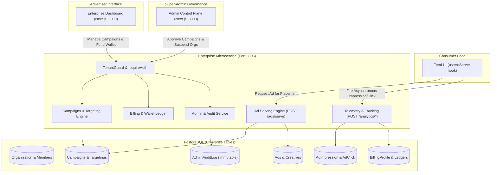
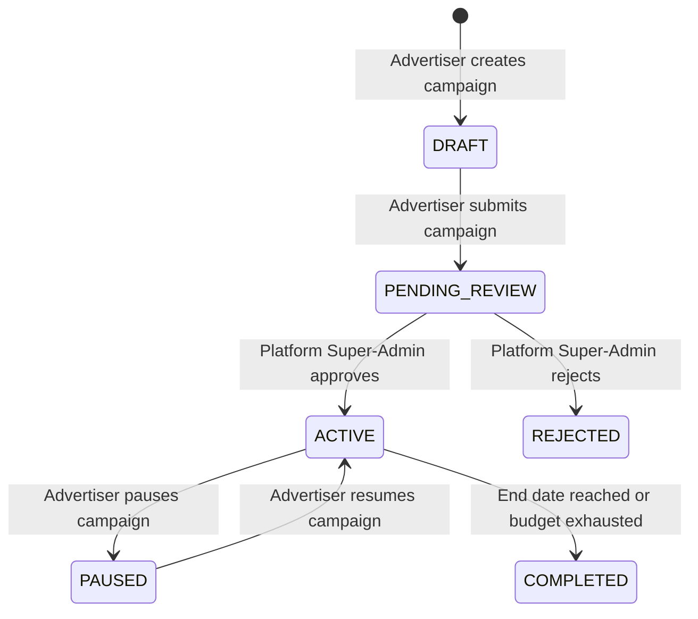
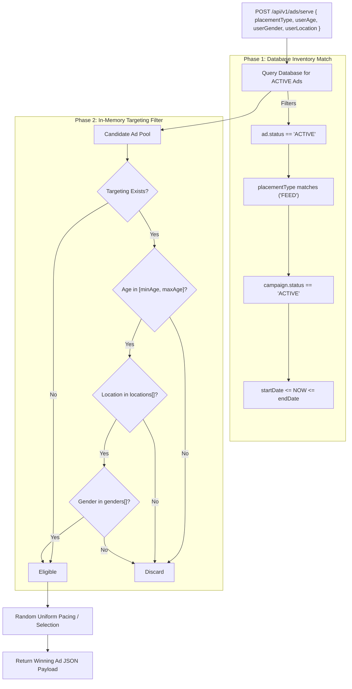
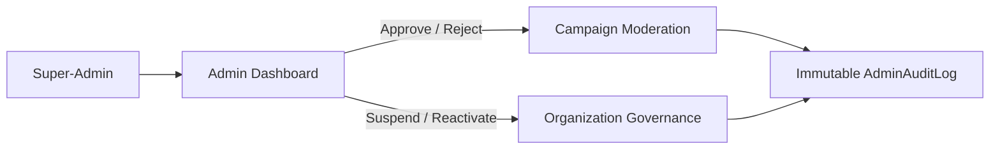

# GiniVibe Enterprise Platform & Ad Network — Architecture Guide

## 1. Executive Summary & Overview

The **GiniVibe Enterprise Platform** is the Business-to-Platform (B2B) advertising and governance subsystem of GiniVibe. It enables external organizations, advertisers, astrology brands, and creators to create, fund, and run targeted advertising campaigns delivered natively into consumer web and mobile feeds.

The service is engineered as a **Service-Oriented Modular Monolith** at `backend/microservices/enterprise`, running on **Port 3005**. It operates concurrently with the consumer platform on a shared PostgreSQL instance, providing mathematical multi-tenant data isolation and a high-performance Ad Serving engine.

---

## 2. High-Level Architecture



---

## 3. Multi-Tenancy & Security (RBAC)

Tenant isolation is the foundational security invariant of the enterprise platform: **Organization A must never view, modify, or enumerate Organization B's data.**

### The Request Pipeline
* **File:** [`backend/microservices/enterprise/src/middleware/tenant.ts`](file:///home/amandeep/Documents/GiniVibe-Astrology-Backup/backend/microservices/enterprise/src/middleware/tenant.ts)

Every administrative request passes through a two-stage security gate:
1. **`requireAuth`**: Decodes the enterprise JWT from the `Authorization: Bearer <token>` header, attaching the verified `EnterpriseUser` to `req.user`.
2. **`requireTenantRole(roles)`**: Reads the `x-organization-id` HTTP header and verifies membership and permissions in the `OrganizationMember` table:

```typescript
export const requireTenantRole = (allowedRoles: EnterpriseRole[]) => {
  return async (req: Request, res: Response, next: NextFunction) => {
    const orgId = req.headers['x-organization-id'] as string;
    const userId = req.user?.id;

    const membership = await prisma.organizationMember.findUnique({
      where: {
        organizationId_userId: { organizationId: orgId, userId }
      }
    });

    if (!membership || !allowedRoles.includes(membership.role)) {
      return res.status(403).json({ error: 'Insufficient permissions' });
    }

    req.organizationId = orgId;
    req.tenantRole = membership.role;
    next();
  };
};
```

### Mathematical Data Isolation
All service and database queries strictly incorporate both the target resource ID and the requesting `organizationId`:
```typescript
await prisma.campaign.findFirst({
  where: {
    id: campaignId,
    organizationId: req.organizationId // Prevents ID enumeration attacks across tenants
  }
});
```

### Role Matrix

| Role | Wallet / Billing | Create / Edit Ads | Targeting | View Analytics | Manage Team |
| :--- | :---: | :---: | :---: | :---: | :---: |
| **OWNER** | Full | Full | Full | Full | Full |
| **ADMIN** | Full | Full | Full | Full | Members |
| **CAMPAIGN_MANAGER** | None | Full | Full | Full | None |
| **ANALYST** | None | None | None | Full | None |
| **VIEWER** | None | None | None | Read-Only | None |

---

## 4. The 8 Business Domains (Modules)

```text
backend/microservices/enterprise/src/modules/
├── identity/          # B2B Registration, Password Hashing (Bcrypt), JWT generation
├── organizations/     # Multi-tenant root, atomic creation transactions
├── billing/           # Prepaid wallet balance, ledger transactions, deposits
├── campaigns/         # Campaign objectives, lifetime budgets, date ranges
├── targeting/         # Demographic, geographic, and interest criteria
├── creatives/         # Ad media metadata (StorageKey, headlines, CTA, URLs)
├── ads/               # Ad assembly (Campaign + Creative + Placements) & Serving
└── analytics/         # High-velocity Impression & Click telemetry
```

### 1. Identity Module
* Manages dedicated enterprise credentials separated from consumer credentials.
* Issues 24-hour cryptographic JWT tokens bearing the user's global enterprise ID.

### 2. Organizations Module
* Uses Prisma `$transaction` blocks to ensure creating an Organization atomically links the creator as `OWNER`.

### 3. Billing & Wallet Module
* Manages a prepaid balance system in `BillingProfile`.
* Advertisers deposit funds via `/billing/funds` before their campaigns can transition out of draft status.

### 4. Campaigns & Lifecycle State Machine



> [!IMPORTANT]
> Advertisers cannot activate their own campaigns. The API enforces that campaigns entering `PENDING_REVIEW` must be reviewed and approved by a `SUPER_ADMIN` on the admin portal.

---

## 5. The Ad Serving Engine (`EligibilityEngine`)

* **File:** [`backend/microservices/enterprise/src/modules/ads/services/eligibility.service.ts`](file:///home/amandeep/Documents/GiniVibe-Astrology-Backup/backend/microservices/enterprise/src/modules/ads/services/eligibility.service.ts)
* **Serving Service:** [`backend/microservices/enterprise/src/modules/ads/services/ad-serving.service.ts`](file:///home/amandeep/Documents/GiniVibe-Astrology-Backup/backend/microservices/enterprise/src/modules/ads/services/ad-serving.service.ts)

When a consumer browses GiniVibe, the client calls `POST /api/v1/ads/serve`. The engine executes a two-phase filtering pipeline:



---

## 6. Telemetry & Financial Reconciliation

* **File:** [`backend/microservices/enterprise/src/modules/analytics/services/analytics.service.ts`](file:///home/amandeep/Documents/GiniVibe-Astrology-Backup/backend/microservices/enterprise/src/modules/analytics/services/analytics.service.ts)

Every rendered ad triggers fire-and-forget telemetry calls back to the enterprise server:

### 1. Impression Tracking (`POST /api/v1/analytics/impression`)
* Fired immediately when the ad component renders on screen.
* Creates an `AdImpression` database record.
* Records fixed cost (CPM model): **₹0.01 per impression**.

### 2. Click Tracking (`POST /api/v1/analytics/click`)
* Fired when the user clicks the Call-To-Action (CTA) or banner.
* Creates an `AdClick` database record.
* Records fixed cost (CPC model): **₹2.00 per click**.

### Real-Time Metrics Aggregation
The analytics engine calculates performance metrics dynamically across organizations and individual campaigns:
* **Impressions:** Total count of `AdImpression` rows.
* **Clicks:** Total count of `AdClick` rows.
* **Click-Through-Rate (CTR):**
  $$\text{CTR} = \frac{\text{Total Clicks}}{\text{Total Impressions}} \times 100$$
* **Total Spend:** Sum of all impression costs and click costs.

---

## 7. Super-Admin Control Plane (`/admin-portal`)

* **Backend Service:** [`backend/microservices/enterprise/src/modules/admin/services/admin.service.ts`](file:///home/amandeep/Documents/GiniVibe-Astrology-Backup/backend/microservices/enterprise/src/modules/admin/services/admin.service.ts)
* **Frontend Portal:** `frontend-web/app/(admin-portal)/admin-dashboard`

The administrative control plane protects platform integrity through governance tools:



### Key Governance Actions:
1. **Campaign Approval Queue:** Fetches all campaigns with `status = 'PENDING_REVIEW'`, displays ad creative previews, and enables 1-click approvals or rejections with justification reasons.
2. **Organization Suspension:** Immediate platform-wide killswitch that sets an organization's status to `SUSPENDED`, instantly removing all of its active ads from consumer feeds.
3. **Immutable Audit Logging (`AdminAuditLog`):** Every administrative action is written to an append-only audit table with `adminId`, `action`, `resourceType`, `resourceId`, IP address, and JSON diffs of previous/new states.

---

## 8. Frontend Web Integration

### A. Advertiser Dashboard Screen
* **File:** [`frontend-web/app/enterprise-dashboard/screens/EnterpriseDashboardScreen.tsx`](file:///home/amandeep/Documents/GiniVibe-Astrology-Backup/frontend-web/app/enterprise-dashboard/screens/EnterpriseDashboardScreen.tsx)
* Provides tabs for **Dashboard Overview**, **Campaigns**, **Billing**, and **Team Settings**.
* Features live metric KPI cards (Total Spend, Delivered Impressions, Clicks, Avg CTR, Running Campaigns).
* Includes modal dialogs for launching new campaigns and depositing prepaid funds.

### B. Consumer Feed Ad Banner
* **Hook:** [`frontend-web/app/core/hooks/useAdServer.ts`](file:///home/amandeep/Documents/GiniVibe-Astrology-Backup/frontend-web/app/core/hooks/useAdServer.ts)
* **Component:** [`frontend-web/app/core/components/NativeAdBanner.tsx`](file:///home/amandeep/Documents/GiniVibe-Astrology-Backup/frontend-web/app/core/components/NativeAdBanner.tsx)

```tsx
// Example usage inside consumer feed
import { useAdServer } from '@/app/core/hooks/useAdServer';
import { NativeAdBanner } from '@/app/core/components/NativeAdBanner';

export function FeedView({ user }) {
  const { adData, trackClick } = useAdServer('FEED', user);

  return (
    <div>
      {/* Consumer Posts */}
      <UserPost post={post1} />
      
      {/* Injected Sponsored Ad */}
      {adData && (
        <NativeAdBanner ad={adData} onAdClick={trackClick} />
      )}
      
      <UserPost post={post2} />
    </div>
  );
}
```

---

## 9. Database Schema Reference

```prisma
model Organization {
  id        String             @id @default(uuid())
  name      String
  status    OrganizationStatus @default(ACTIVE)
  createdAt DateTime           @default(now())

  members    OrganizationMember[]
  campaigns  Campaign[]
  creatives  Creative[]
  billing    BillingProfile?
}

model Campaign {
  id             String         @id @default(uuid())
  organizationId String
  name           String
  status         CampaignStatus @default(DRAFT)
  budget         Decimal        @db.Decimal(10, 2)
  startDate      DateTime
  endDate        DateTime?

  organization Organization    @relation(fields: [organizationId], references: [id])
  ads          Advertisement[]
  targeting    TargetingRule?
}

model TargetingRule {
  id         String   @id @default(uuid())
  campaignId String   @unique
  minAge     Int?
  maxAge     Int?
  locations  String[]
  interests  String[]
  genders    String[]
}

model Creative {
  id             String    @id @default(uuid())
  organizationId String
  mediaType      MediaType
  storageKey     String
  headline       String?
  description    String?
  ctaText        String?
  destinationUrl String?
}

model Advertisement {
  id          String   @id @default(uuid())
  campaignId  String
  creativeId  String
  status      AdStatus @default(DRAFT)

  impressions AdImpression[]
  clicks      AdClick[]
  placements  AdPlacement[]
}

model BillingProfile {
  id             String   @id @default(uuid())
  organizationId String   @unique
  balance        Decimal  @default(0.00) @db.Decimal(10, 2)
  currency       String   @default("INR")
}

model AdminAuditLog {
  id             String   @id @default(uuid())
  adminId        String
  action         String
  resourceType   String
  resourceId     String
  organizationId String?
  metadata       Json?
  createdAt      DateTime @default(now())
}
```

---

## 10. API Specification Reference

| Method | Route | Auth / Headers | Purpose |
| :--- | :--- | :--- | :--- |
| `POST` | `/api/v1/identity/register` | Public | Register enterprise account |
| `POST` | `/api/v1/identity/login` | Public | Login & receive enterprise JWT |
| `POST` | `/api/v1/organizations` | Bearer Token | Create new tenant organization |
| `GET` | `/api/v1/campaigns` | `x-organization-id` | List organization campaigns |
| `POST` | `/api/v1/campaigns` | `x-organization-id` | Create draft campaign |
| `PATCH`| `/api/v1/campaigns/:id/status` | `x-organization-id` | Submit campaign for review |
| `POST` | `/api/v1/billing/funds` | `x-organization-id` | Deposit funds to wallet |
| `POST` | `/api/v1/ads/serve` | Public | Ad engine candidate serving |
| `POST` | `/api/v1/analytics/impression` | Public | Log impression telemetry |
| `POST` | `/api/v1/analytics/click` | Public | Log click telemetry |
| `GET` | `/admin/campaigns/pending` | Admin Token | Super-Admin pending queue |
| `POST` | `/admin/campaigns/:id/approve`| Admin Token | Super-Admin campaign approval |
| `POST` | `/admin/organizations/:id/suspend`| Admin Token | Suspend organization |

---

## 11. Developer Runbook & Verification

```bash
# 1. Start Enterprise Service
cd backend/microservices/enterprise
npm install
npm run dev

# Microservice listens on Port 3005

# 2. Test Ad Serving via cURL
curl -X POST http://localhost:3005/api/v1/ads/serve \
  -H "Content-Type: application/json" \
  -d '{
    "placementType": "FEED",
    "userAge": 25,
    "userGender": "Male",
    "userLocation": "India"
  }'

# 3. Test Impression Telemetry
curl -X POST http://localhost:3005/api/v1/analytics/impression \
  -H "Content-Type: application/json" \
  -d '{"advertisementId": "<ad-id>", "placementType": "FEED"}'
```
