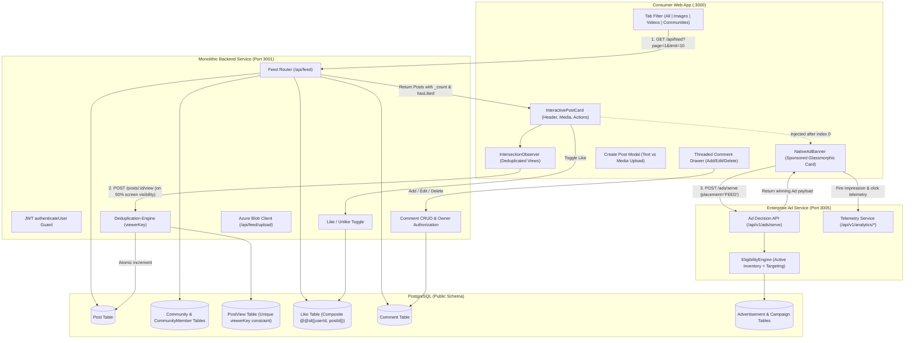
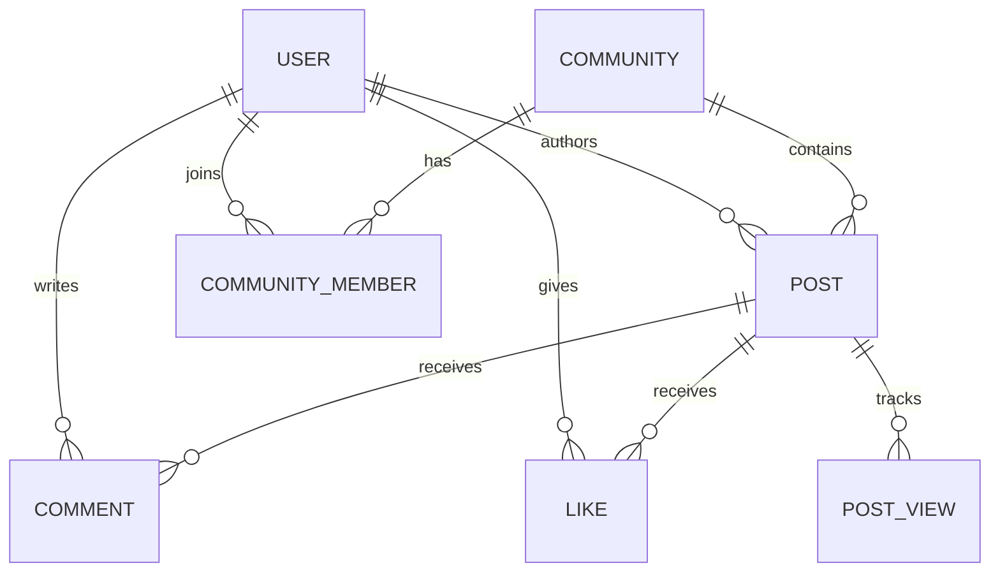
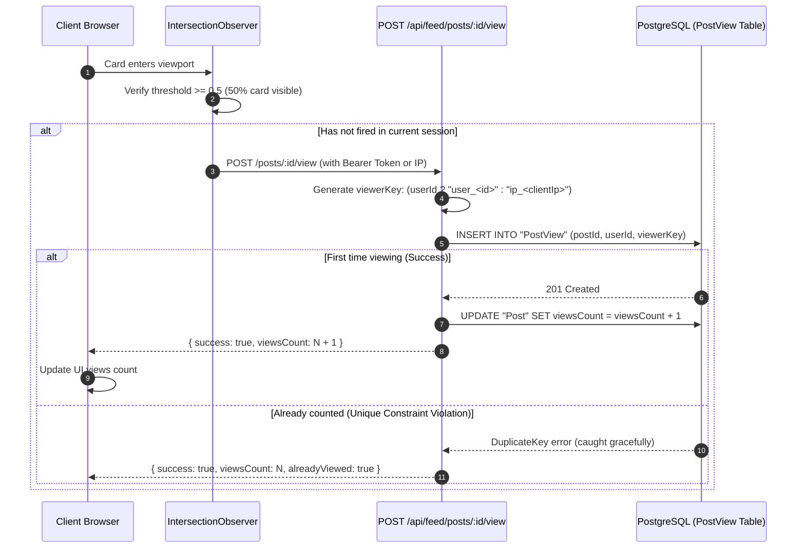

# GiniVibe Social Feed & Community Media System — Architecture & Operations Guide

## 1. Executive Summary & Overview

The **GiniVibe Social Feed System** is the core interactive community surface of the GiniVibe platform. It delivers a rich, multimedia social stream uniting text updates, high-resolution photography, streaming videos, and community discussions.

The system is designed with four core pillars:
1. **Interactive Multimedia**: Seamless rendering of text posts, high-definition images, and playable video assets (both external CDN and native `/android-video.mp4` streams).
2. **Community Categorization**: Contextual grouping where creators and members tag posts to verified interest sanctuaries (e.g. *Cosmic Wanderers & Stargazers*, *Soundscapes & Healing Frequencies*).
3. **High-Fidelity Engagement**: Optimistic likes, threaded inline comments (with edit/delete authorization), native Web Share integration, and deduplicated social view tracking via `IntersectionObserver`.
4. **First-Party Native Ad Monetization**: Direct integration with the **GiniVibe Enterprise Ad Network** (`backend/microservices/enterprise`, port `3005`) where sponsored native banners are dynamically embedded directly into the feed stream.

---

## 2. High-Level Architecture

The feed spans three primary layers: **Consumer Frontend (`frontend-web`)**, the **Monolithic Backend Core (Port 3001)**, and the **Enterprise Ad Microservice (Port 3005)** on top of **PostgreSQL**.



---

## 3. Database Entities & Relational Schema

The social feed models are defined in [`backend/monolithic/prisma/schema.prisma`](file:///home/amandeep/Documents/Ginivibe/GiniVibe/backend/monolithic/prisma/schema.prisma):



### Key Models Reference

#### 1. `Post`
The primary social record containing the text content, media array, author relation, and aggregate counters:
```prisma
model Post {
  id          String     @id @default(uuid())
  userId      String
  communityId String?
  title       String?
  body        String?
  mediaUrls   String[]   @default([])
  contentType String     @default("text") // 'text' | 'image' | 'video'
  viewsCount  Int        @default(0)
  createdAt   DateTime   @default(now())
  updatedAt   DateTime   @updatedAt
  comments    Comment[]
  likes       Like[]
  community   Community? @relation(fields: [communityId], references: [id])
  user        User       @relation(fields: [userId], references: [id], onDelete: Cascade)
  views       PostView[]

  @@index([userId])
  @@index([communityId])
}
```

#### 2. `Community` & `CommunityMember`
Enables interest-based sub-feeds and communities:
```prisma
model Community {
  id          String            @id @default(uuid())
  name        String            @unique
  description String?
  category    String
  cityScope   String?
  ownerId     String
  createdAt   DateTime          @default(now())
  updatedAt   DateTime          @updatedAt
  owner       User              @relation("CommunityOwner", fields: [ownerId], references: [id], onDelete: Cascade)
  members     CommunityMember[]
  posts       Post[]
}

model CommunityMember {
  userId      String
  communityId String
  joinedAt    DateTime  @default(now())
  community   Community @relation(fields: [communityId], references: [id], onDelete: Cascade)
  user        User      @relation(fields: [userId], references: [id], onDelete: Cascade)

  @@id([userId, communityId])
}
```

#### 3. `Like`
Composite-keyed engagement entity ensuring a user can only like a post once:
```prisma
model Like {
  userId    String
  postId    String
  createdAt DateTime @default(now())
  Post      Post     @relation(fields: [postId], references: [id], onDelete: Cascade)
  User      User     @relation(fields: [userId], references: [id], onDelete: Cascade)

  @@id([userId, postId])
}
```

#### 4. `PostView`
Deduplicated view registration table preventing fraudulent view inflation:
```prisma
model PostView {
  id        String   @id @default(uuid())
  postId    String
  userId    String?
  viewerKey String   // e.g. "user_<uuid>" or "ip_<clientIp>"
  createdAt DateTime @default(now())
  post      Post     @relation(fields: [postId], references: [id], onDelete: Cascade)

  @@unique([postId, viewerKey])
}
```

---

## 4. Frontend Architecture & UI Walkthrough

The feed user interface is implemented in [`frontend-web/app/(dashboard)/feed/screens/FeedDashboard.tsx`](file:///home/amandeep/Documents/Ginivibe/GiniVibe/frontend-web/app/(dashboard)/feed/screens/FeedDashboard.tsx).

### 1. The Category Tabs System
Users can switch between 4 specialized perspectives:

```typescript
const filteredPosts = useMemo(() => {
  return posts.filter((post) => {
    if (activeTab === 'all') return true;
    if (activeTab === 'communities') return Boolean(post.community && post.community.id);
    if (activeTab === 'images') {
      return (
        post.contentType === 'image' ||
        (post.mediaUrls && post.mediaUrls.some((url) => !url.match(/\.(mp4|webm|mov|mkv)$/i)))
      );
    }
    if (activeTab === 'videos') {
      return (
        post.contentType === 'video' ||
        (post.mediaUrls && post.mediaUrls.some((url) => url.match(/\.(mp4|webm|mov|mkv)$/i)))
      );
    }
    return true;
  });
}, [posts, activeTab]);
```

* **`All Posts` (`all`)**: Shows the unfiltered chronological stream.
* **`Images` (`images`)**: Filters down to posts with `contentType === 'image'` or image file extensions (`.jpg`, `.png`, `.webp`).
* **`Videos` (`videos`)**: Filters down to posts with `contentType === 'video'` or video file extensions (`.mp4`, `.webm`, `.mov`).
* **`Communities` (`communities`)**: Filters down to posts linked to an official GiniVibe community (`post.community.id`).

---

### 2. The Anatomy of an `InteractivePostCard`

Each social post renders as an elevated dark card (`#0f172a`, border: `1px solid #1e293b`, radius: `14px`):

```text
┌────────────────────────────────────────────────────────────────────────┐
│  [A]  Aria Thorne  [c/ Zodiac Insights & Natal Wisdom]                 │
│       @ariacosmic • 05:42 PM                                           │
│                                                                        │
│  Celestial Equinox Alignment: Navigating the Sun-Jupiter Trine         │
│  This week's planetary transit marks a rare trine between the Sun      │
│  in Virgo and Jupiter in Taurus, grounding expansive visions...        │
│                                                                        │
│  ┌──────────────────────────────────────────────────────────────────┐  │
│  │                                                                  │  │
│  │                     [ Image / Video Player ]                     │  │
│  │                                                                  │  │
│  └──────────────────────────────────────────────────────────────────┘  │
│                                                                        │
│  [♥ 36]     [💬 4 Comments]     [👁 980 Views]               [↗ Share] │
└────────────────────────────────────────────────────────────────────────┘
```

1. **Author Avatar**: Circular gradient avatar displaying the author's first initial with uppercase styling.
2. **Author Identity**: Author's display name and username handle (`@username`).
3. **Community Pill Badge**: When a post belongs to a community, a purple pill tag appears:
   ```tsx
   {post.community?.name && (
     <span className="community-badge">
       <Users size={11} /> {post.community.name}
     </span>
   )}
   ```
4. **Title & Body**: Bold heading hierarchy (`16px`, `#f1f5f9`) and high-legibility body text (`14px`, `#cbd5e1`, line height: `1.5`).
5. **Responsive Media Renderer**:
   * If URL ends with `.mp4`/`.webm`/`.mov`: Renders `<video controls style={{ width: '100%', maxHeight: '420px', objectFit: 'contain' }} />`.
   * If URL is an image: Renders ``.
6. **Action Bar**:
   * **Like Button**: Real-time heart animation with optimistic state toggle (`isLiked ? '#ef4444' : '#94a3b8'`).
   * **Comment Button**: Toggles the sliding threaded comment drawer.
   * **Social View Count**: Displays total validated views with an eye icon (`#60a5fa`).
   * **Share Button**: Invokes the native Web Share API or copies the link with a temporary "Copied!" tooltip.

---

### 3. Inline Threaded Comments Drawer
Clicking the comment button opens an integrated discussion area directly within the card:
* **Add Comment**: Form with input and primary submit button. Immediately appends the new comment without reloading the page.
* **Inline Comment Editing**: If the logged-in user is the author of a comment, an **Edit** button toggles inline editing mode (`handleEditComment`).
* **Comment Deletion**: If the logged-in user is the comment author OR the post owner, a **Delete** button triggers a confirmation and executes removal (`handleDeleteComment`).

---

### 4. Native In-Feed Sponsored Ad Injection
To ensure organic monetization without disrupting UX, the feed automatically positions a **Sponsored Ad Banner** after the first post:

```tsx
{filteredPosts.map((post, index) => (
  <React.Fragment key={post.id}>
    <InteractivePostCard post={post} currentUserId={user?.id} />
    
    {/* Native In-Feed Sponsored Placement after the first post */}
    {index === 0 && (
      <NativeAdBanner placement="FEED" currentUser={user} />
    )}
  </React.Fragment>
))}
```
* If the feed is empty, `<NativeAdBanner>` renders below the empty state message.
* The ad is fetched dynamically from `http://localhost:3005/api/v1/ads/serve` via the `useAdServer('FEED', user)` hook.
* Features a "Sponsored" glassmorphic tag, headline, description, image or auto-looping video, and CTA button.

---

### 5. Create Post Modal Dialog
Users click the `+ Create Post` button in the top right to open an interactive creation modal:
1. **Type Selector**: Toggle between **Text Only** and **Image / Video**.
2. **Title Field**: Required for text posts; optional for media posts.
3. **Body / Description Field**: Multi-line textarea for post thoughts and insights.
4. **File Dropzone (Media Mode)**:
   * Supports dragging and dropping or browsing image/video files.
   * Shows instant preview with file size.
   * Uploads to Azure Blob Storage via `POST /api/feed/upload`.

---

## 5. View Counting & Deduplication Logic

To prevent artificial view inflation (e.g. users refreshing the page or spamming requests), view counting is handled through a two-stage verification:



---

## 6. Complete API Reference

Base URL: `http://localhost:3001/api/feed`

| Method | Endpoint | Auth | Description |
| :--- | :--- | :--- | :--- |
| `GET` | `/` | Optional | Get paginated posts (`?page=1&limit=10`) with `_count` and `hasLiked` |
| `POST` | `/posts` | Bearer Token | Create a new post (`title`, `body`, `mediaUrls`, `contentType`, `communityId`) |
| `POST` | `/posts/:id/view` | Public / Optional | Register a deduplicated view based on `viewerKey` |
| `POST` | `/posts/:id/like` | Bearer Token | Toggle like status for the authenticated user |
| `GET` | `/posts/:id/comments` | Optional | Retrieve threaded comments for a post |
| `POST` | `/posts/:id/comments` | Bearer Token | Post a new comment |
| `PATCH` | `/comments/:id` | Bearer Token | Edit comment body (comment author only) |
| `DELETE` | `/comments/:id` | Bearer Token | Delete comment (comment author or post owner) |
| `POST` | `/upload` | Public / Token | Upload media file to Azure Blob storage |

---

## 7. Developer Runbook & Verification

### Step 1: Start the Backend Services
Make sure both the monolithic backend and enterprise ad services are running:

```bash
# Terminal 1: Monolithic Backend (Feed, Auth, Communities)
cd backend/monolithic
npm run dev
# Listens on http://localhost:3001

# Terminal 2: Enterprise Microservice (Ad Server)
cd backend/microservices/enterprise
npm run dev
# Listens on http://localhost:3005

# Terminal 3: Frontend Web
cd frontend-web
npm run dev
# Listens on http://localhost:3000
```

### Step 2: Seed the Demo Feed Data
To refresh or populate creator accounts, communities, and multimedia posts:

```bash
cd backend/monolithic
npx tsx src/seed_feed.ts
```

Expected output:
```text
🌟 Seeding vibrant demo data for Social Feed...
👤 User ready: @ariacosmic (Aria Thorne)
👤 User ready: @marcus_deepsky (Marcus Chen)
👤 User ready: @elena_vibe (Elena Rostova)
👤 User ready: @devon_ai (Devon Patel)
🪐 Community ready: Cosmic Wanderers & Stargazers
🪐 Community ready: Soundscapes & Healing Frequencies
🪐 Community ready: Zodiac Insights & Natal Wisdom
🪐 Community ready: Next-Gen AI & Creative Tech
📝 Post created: "James Webb Deep Field Analysis: The..." [image]
📝 Post created: "Aurora Borealis Sound Meditation — ..." [video]
📝 Post created: "Celestial Equinox Alignment: Naviga..." [image]
📝 Post created: "GiniVibe Android & Mobile Experienc..." [video]
📝 Post created: "Sierra High Desert Stargazing Camp:..." [image]
📝 Post created: "Weekly Community Circle: How do pla..." [text]
🎉 Social Feed successfully seeded with vibrant posts, communities, images, and videos!
```

### Step 3: Interactive UI Verification Checklist
Open **[http://localhost:3000/feed](http://localhost:3000/feed)** and verify:
1. [x] **All Posts**: Shows the complete stream with the **Sponsored Ad Banner** positioned after the first post.
2. [x] **Images**: Filter displays high-definition astrophotography and cosmic art.
3. [x] **Videos**: Filter displays Tromsø Aurora Borealis timelapse and GiniVibe Android 120Hz demo video with controls.
4. [x] **Communities**: Filter displays posts tagged with purple community badges (`Cosmic Wanderers`, `Soundscapes`, etc.).
5. [x] **Heart Like**: Clicking heart toggles red fill and increments/decrements the count.
6. [x] **Comments**: Clicking comment button opens threaded comments and allows posting new comments.
7. [x] **Deduplicated Views**: Scrolling past posts increments the view counter on the first pass.
