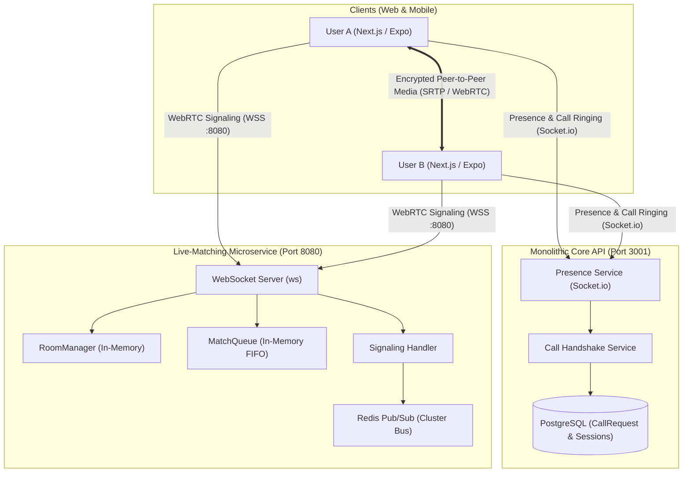
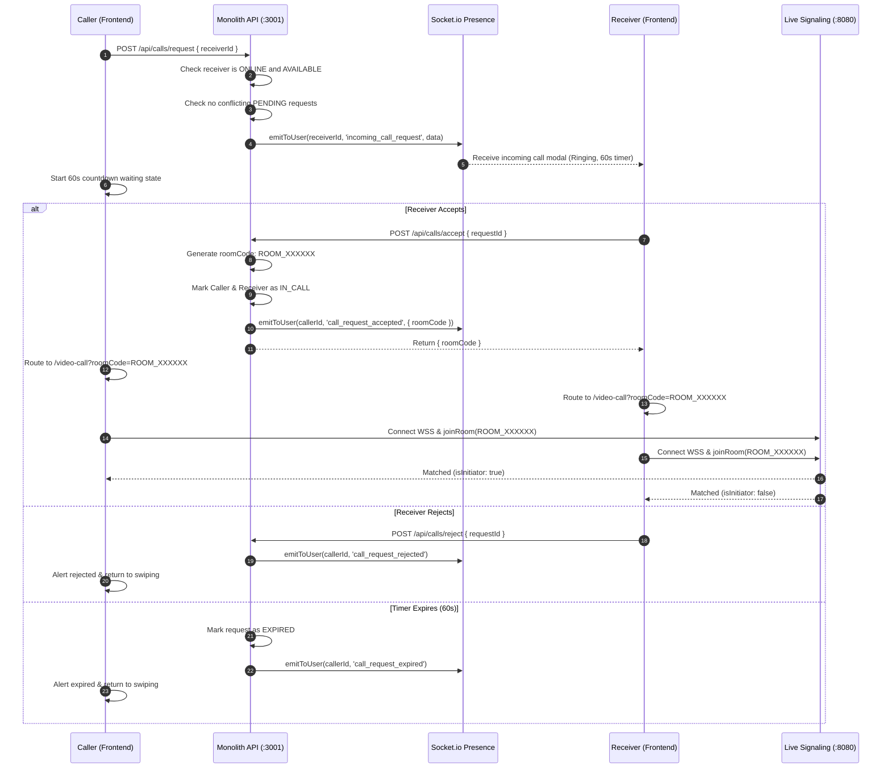
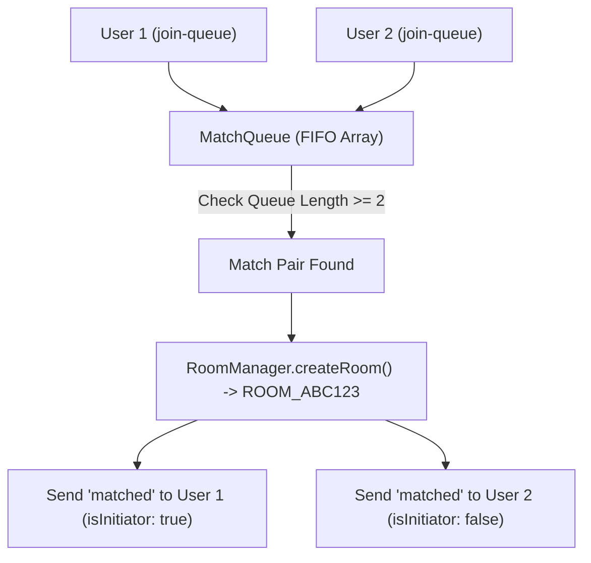
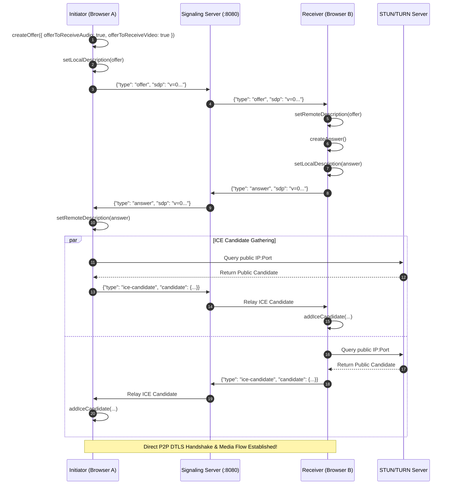

# GiniVibe Live Matching — Comprehensive Architecture & WebRTC Guide

## 1. Executive Summary & Overview

The **Live Matching** subsystem provides real-time, peer-to-peer (P2P) video and audio matchmaking on GiniVibe. Designed for ultra-low latency (<200ms media delivery), the architecture is partitioned into two specialized tiers:

1. **Global Presence & Targeted Handshake (Monolith, Port 3001):** Utilizes `Socket.io` and PostgreSQL to track online user presence, manage user availability (`AVAILABLE`, `BUSY`, `IN_CALL`, `OFFLINE`), and coordinate 1-on-1 ringing call invites.
2. **High-Throughput WebRTC Signaling Engine (Microservice, Port 8080):** A zero-database, pure Node.js `ws` server optimized for high-concurrency SDP offer/answer relaying, ICE candidate routing, random FIFO matching queues, and room lifecycle management.

---

## 2. Dual Real-Time Architecture

To maintain high availability and prevent media signaling bottlenecks from impacting consumer account data, the real-time pipeline is decoupled:



---

## 3. Targeted 1-on-1 Call Handshake Flow

When a user initiates a live video call to another user from the Matching Hub (`/matching`), a structured handshake executes across the Monolith before users are handed off to the WebRTC signaling engine:



---

## 4. Instant Random Live Matching (`MatchQueue`)

When users select **Instant Random Video Matching**, the call bypasses the 1-on-1 handshake and directly enters the high-speed in-memory matchmaking queue on the Live-Matching microservice.

* **File:** [`backend/microservices/live-matching/src/matchQueue.js`](file:///home/amandeep/Documents/GiniVibe-Astrology-Backup/backend/microservices/live-matching/src/matchQueue.js)



### Queue Mechanics:
1. **FIFO Fairness:** Users are placed in a simple queue array `[{ userId, ws, joinedAt }]`.
2. **Instant Pair Pairing:** When a user arrives, if the queue contains waiting users, the oldest waiting user (`peer`) is popped immediately.
3. **Initiator Assignment:** The waiting peer is assigned `isInitiator: true` (creating the WebRTC SDP offer), while the joining user receives `isInitiator: false` (awaiting the offer to produce an answer).
4. **Stale Connection Cleanup:** The queue regularly purges disconnected sockets to ensure no user gets paired with a dead connection.

---

## 5. WebRTC Signaling & NAT Traversal Mechanics

* **File:** [`backend/microservices/live-matching/src/signaling.js`](file:///home/amandeep/Documents/GiniVibe-Astrology-Backup/backend/microservices/live-matching/src/signaling.js)

Once two users enter a room, the microservice acts as an SDP/ICE mailbox:



### STUN / TURN Configuration:
* **Default STUN:** `stun:stun.l.google.com:19302`, `stun:stun1.l.google.com:19302`
* **TURN Server Support:** Configured via `TURN_SERVER`, `TURN_USERNAME`, and `TURN_CREDENTIAL` environment variables. Essential for establishing connections behind strict corporate symmetric NATs and mobile carrier firewalls.

---

## 6. Frontend Web Client Architecture (`VideoCallClient`)

* **File:** [`frontend-web/app/(dashboard)/video-call/VideoCallClient.ts`](file:///home/amandeep/Documents/GiniVibe-Astrology-Backup/frontend-web/app/(dashboard)/video-call/VideoCallClient.ts)
* **UI Page:** [`frontend-web/app/(dashboard)/video-call/page.tsx`](file:///home/amandeep/Documents/GiniVibe-Astrology-Backup/frontend-web/app/(dashboard)/video-call/page.tsx)

### Client Lifecycle State Machine:
```text
  [ IDLE ] ──> getUserMedia() ──> [ CONNECTED ]
                                         │
                 ┌───────────────────────┴───────────────────────┐
                 ▼                                               ▼
         [ joinRoom(code) ]                                [ findMatch() ]
                 │                                               │
                 ▼                                               ▼
          [ WAITING / FOUND ] ◀───────────────────────── [ SEARCHING IN QUEUE ]
                 │
                 ▼
        [ WEBRTC NEGOTIATION ] (Offer/Answer/ICE)
                 │
                 ▼
           [ IN_CALL ] ──(Adaptive Bitrate & Stats Monitoring)
                 │
                 ├── [ Network Change / Interruption ] ──> [ ICE RESTART ]
                 │
                 └── [ endCall() / Disconnect ] ──> [ IDLE / NAVIGATE AWAY ]
```

### Production Resiliency Features:

#### 1. Mobile App Backgrounding (`visibilitychange`)
When a mobile browser tab is minimized or sent to the background:
* Halts WebRTC statistics monitoring to prevent battery drain.
* Upon returning (`document.visibilityState === 'visible'`), checks WebSocket liveness and triggers automatic reconnection if the socket dropped.

#### 2. Network Interface Switching (WiFi <-> Cellular)
Monitors `navigator.connection` for network handoffs:
* Triggers an automatic **ICE Restart** (`pc.createOffer({ iceRestart: true })`) to re-gather network candidates and prevent call drops when walking out of WiFi range.

#### 3. Adaptive Video Quality Engine
Monitors RTCPeerConnection statistics (`pc.getStats()`) every 3 seconds:
* Computes bitrate, packet loss percentage, round-trip time (RTT), and jitter.
* Automatically adjusts `RTCRtpSender` encoding parameters:

| Quality Tier | Bitrate Limit | Max Framerate | Trigger Conditions |
| :--- | :--- | :--- | :--- |
| **Excellent** | 1,500 kbps (1.5 Mbps) | 30 fps | Normal conditions, RTT < 150ms |
| **Good** | 800 kbps | 24 fps | Bitrate < 500 kbps or RTT > 150ms |
| **Poor** | 300 kbps | 15 fps | Bitrate < 200 kbps or Packet Loss > 5% |
| **Critical** | 100 kbps | 10 fps | Bitrate < 50 kbps or Packet Loss > 10% |

---

## 7. Security & Server Protection

* **Circuit Breaker:** Rejects incoming WebSocket connections with HTTP `503 Service Unavailable` when concurrent clients exceed `MAX_TOTAL_CONNECTIONS` (default: 50,000).
* **Per-IP Rate Limiting:** Enforces `MAX_CONNECTIONS_PER_IP` (default: 5) to mitigate Sybil and DDoS attacks.
* **Message Throttling:** Restricts incoming socket messages to a sliding window of 20 messages per second per user.
* **Max Payload Cap:** Strict 64 KB message payload ceiling prevents memory exhaustion attacks via oversized SDP bodies.
* **SSL/TLS Auto-Detection:** Automatically inspects `./certs/cert.pem` and `./certs/key.pem` to switch between `ws://` and secure `wss://`.

---

## 8. WebSocket Protocol Reference

All signaling messages are formatted as JSON strings:

### Client -> Server Messages

| Type | Payload Parameters | Description |
| :--- | :--- | :--- |
| `join-queue` | `{}` | Enters the random matching queue |
| `leave-queue` | `{}` | Removes user from random matching queue |
| `create-room` | `{}` | Creates a new random room code |
| `join-room` | `{ roomCode: string }` | Joins an existing room |
| `offer` | `{ sdp: string }` | Forwards WebRTC SDP offer to peer |
| `answer` | `{ sdp: string }` | Forwards WebRTC SDP answer to peer |
| `ice-candidate`| `{ candidate: object }` | Forwards ICE candidate to peer |
| `end-call` | `{}` | Explicitly terminates active call |

### Server -> Client Messages

| Type | Payload Parameters | Description |
| :--- | :--- | :--- |
| `welcome` | `{ userId, iceServers }` | Sent on initial socket connection |
| `queue-joined` | `{ position: number }` | Confirms queue placement |
| `matched` | `{ roomCode, isInitiator: boolean }` | Prompts client to begin WebRTC |
| `room-created`| `{ roomCode }` | Confirms room allocation |
| `room-joined` | `{ roomCode, message }` | Confirms entry into room |
| `offer` | `{ sdp: string }` | Relayed SDP offer from remote peer |
| `answer` | `{ sdp: string }` | Relayed SDP answer from remote peer |
| `ice-candidate`| `{ candidate: object }` | Relayed ICE candidate from remote peer |
| `peer-disconnected`| `{ reason: string }` | Notifies that peer closed connection |
| `call-ended` | `{ reason: string }` | Confirms call teardown |
| `error` | `{ message: string }` | Reports operational failure |

---

## 9. Developer Execution & Verification

To run and verify the Live Matching microservice locally:

```bash
# 1. Start the Live-Matching microservice
cd backend/microservices/live-matching
npm install
npm run dev

# Server will listen on ws://localhost:8080 (or wss:// if certs exist)

# 2. Inspect Server Health & Metrics
curl http://localhost:8080/health
curl http://localhost:8080/metrics

# 3. Test Room Existence Endpoint
curl http://localhost:8080/room/ROOM_TEST12/exists

# 4. Open the built-in standalone test client in browser
# Visit: http://localhost:8080/client/
```
