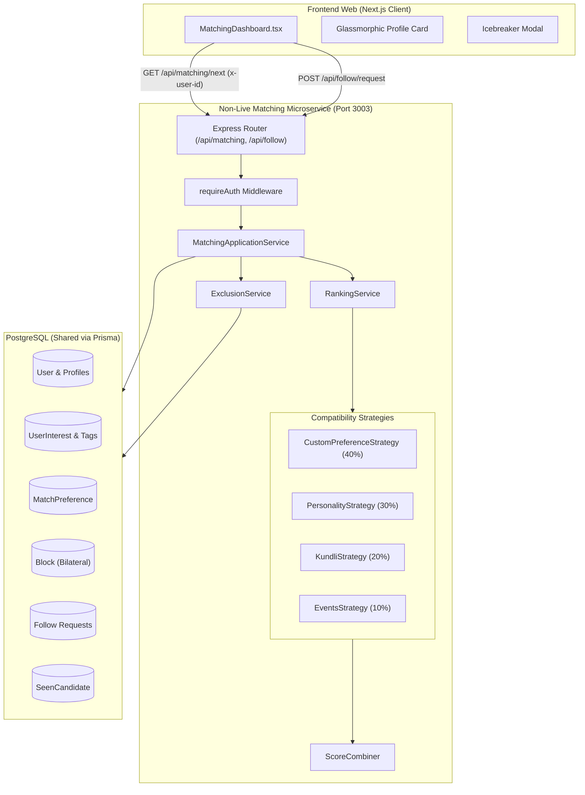
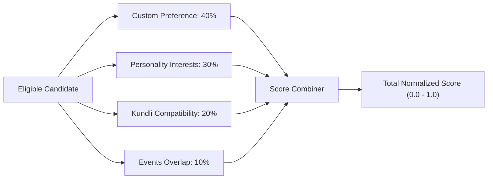
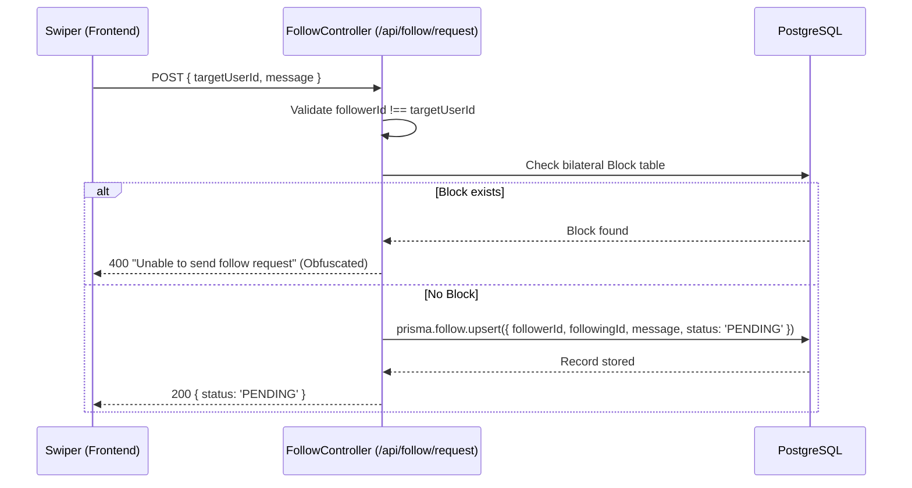

# GiniVibe Non-Live Matching — Comprehensive Architecture & Implementation Guide

## 1. Executive Summary & Overview

The **Non-Live Matching** system is GiniVibe's algorithmic discovery and matchmaking pipeline. Unlike the ephemeral, synchronous WebRTC live matching engine, non-live matching delivers an asynchronous discovery experience where users browse, evaluate, and connect with curated candidate profiles based on deep multi-factor compatibility algorithms.

The service operates as an autonomous microservice located at `backend/microservices/non-live-matching`, running on **Port 3003**, consuming and modifying the unified PostgreSQL database, and rendering rich glassmorphic profile cards on the Next.js web frontend (`frontend-web/app/(dashboard)/matching`).

---

## 2. High-Level Architecture

The non-live matching ecosystem connects the Next.js frontend client to the specialized TypeScript backend via REST APIs, leveraging Domain-Driven Design (DDD) to isolate domain rules from infrastructure and delivery mechanisms.



---

## 3. Backend Architecture (Domain-Driven Design)

The backend is organized according to strict clean architecture and Domain-Driven Design principles:

```text
backend/microservices/non-live-matching/
├── prisma/
│   └── schema.prisma              # Data models and relationships
├── src/
│   ├── api/                       # Delivery Layer (HTTP/REST)
│   │   ├── controllers/           # Request/Response orchestration
│   │   │   ├── matching.controller.ts
│   │   │   └── follow.controller.ts
│   │   ├── middlewares/           # Authentication & request guarding
│   │   │   └── requireAuth.ts
│   │   └── routes/                # Route definitions
│   │       ├── matching.routes.ts
│   │       └── follow.routes.ts
│   ├── application/               # Application Layer (Use cases)
│   │   ├── matching.service.ts    # Main pipeline orchestrator
│   │   ├── exclusion.service.ts   # Candidate filtering logic
│   │   └── ranking.service.ts     # Candidate scoring & ordering
│   ├── domain/                    # Pure Domain Layer (Types & Contracts)
│   │   ├── candidate/             # Candidate entity & provider contract
│   │   ├── exclusion/             # Exclusion context definitions
│   │   ├── matching/              # Matching context & Strategy interface
│   │   └── scoring/               # Score models & weighted combiner
│   ├── infrastructure/            # Infrastructure Layer (External I/O)
│   │   └── postgres/
│   │       ├── client.ts          # Prisma client connection pool
│   │       └── repositories/      # Database queries for candidates & exclusions
│   ├── strategies/                # Concrete Matching Strategy implementations
│   │   ├── custom/                # Age & gender preferences
│   │   ├── personality/           # Jaccard similarity on interest tags
│   │   ├── kundli/                # Vedic astrology & zodiac affinity
│   │   └── events/                # Event overlap boosting
│   ├── app.ts                     # Express app setup, CORS & routes mounting
│   └── server.ts                  # Server entrypoint & graceful shutdown
```

---

## 4. The 4 Matching Strategies & Scoring Formula

The matching algorithm runs every eligible candidate through a suite of four independent strategies. Each strategy returns a normalized score between `0.0` and `1.0`.



### Strategy 1: Custom Preference Strategy (`CustomPreferenceStrategy`)
* **File:** [`src/strategies/custom/custom.strategy.ts`](file:///home/amandeep/Documents/GiniVibe-Astrology-Backup/backend/microservices/non-live-matching/src/strategies/custom/custom.strategy.ts)
* **Weight:** `0.40` (40% of total score)
* **Purpose:** Evaluates explicit user criteria regarding age range and preferred gender.
* **Scoring Logic:**
  * Base score begins at `1.0`.
  * **Gender Check:** If the candidate's gender differs from `context.preferences.preferredGender`, deduct `0.5`.
  * **Age Check:** Candidate age is calculated from date of birth (`dob`). If the age falls outside `[minAge, maxAge]`, deduct `0.5`.
  * **Floor Value:** Uses `Math.max(0.1, score)` to prevent valid candidates from being completely wiped out by soft preferences.

### Strategy 2: Personality Interests Strategy (`PersonalityStrategy`)
* **File:** [`src/strategies/personality/personality.strategy.ts`](file:///home/amandeep/Documents/GiniVibe-Astrology-Backup/backend/microservices/non-live-matching/src/strategies/personality/personality.strategy.ts)
* **Weight:** `0.30` (30% of total score)
* **Purpose:** Measures psychological and lifestyle commonality through interest taxonomy.
* **Algorithm:** **Jaccard Similarity Index**
  $$\text{Score} = \frac{|A \cap B|}{|A \cup B|}$$
  Where $A$ is the set of the querying user's interests, and $B$ is the candidate's interests.
* **Edge Case:** If either user lacks tagged interests, returns a neutral fallback score of `0.5`.

### Strategy 3: Kundli & Astrological Compatibility Strategy (`KundliStrategy`)
* **File:** [`src/strategies/kundli/kundli.strategy.ts`](file:///home/amandeep/Documents/GiniVibe-Astrology-Backup/backend/microservices/non-live-matching/src/strategies/kundli/kundli.strategy.ts)
* **Weight:** `0.20` (20% of total score)
* **Purpose:** Matches users according to Vedic astrological affinity and western zodiac harmony.
* **Scoring Logic:**
  1. **Direct Ashtakoota Kundli Score:** If calculated birth-chart compatibility points exist (out of 36 Gunas), the score is:
     $$\text{Score} = \frac{\text{Gunas}}{36.0}$$
  2. **Zodiac Compatibility Matrix (Fallback):**
     * Highly compatible elemental trines (e.g., Aries with Leo, Sagittarius, Gemini, Aquarius): Score = `1.0`.
     * Same Zodiac Sign: Score = `0.8`.
     * Non-harmonious signs: Score = `0.3`.
     * Missing Zodiac Data: Score = `0.5` (Neutral).

### Strategy 4: Events Overlap Strategy (`EventsStrategy`)
* **File:** [`src/strategies/events/events.strategy.ts`](file:///home/amandeep/Documents/GiniVibe-Astrology-Backup/backend/microservices/non-live-matching/src/strategies/events/events.strategy.ts)
* **Weight:** `0.10` (10% of total score)
* **Purpose:** Rewards candidates who participate in the same offline/online community events.
* **Scoring Logic:**
  * If $|A \cap B| = 0$, returns `0.0`.
  * If 1 or more events overlap, awards a base score of `0.5` plus `0.1` per additional overlapping event, capped at `1.0`:
    $$\text{Score} = \min(0.5 + (|A \cap B| \times 0.1), 1.0)$$

### Composite Score Formula (`ScoreCombiner`)
* **File:** [`src/domain/scoring/score.combiner.ts`](file:///home/amandeep/Documents/GiniVibe-Astrology-Backup/backend/microservices/non-live-matching/src/domain/scoring/score.combiner.ts)
$$\text{Total Score} = \frac{\sum (\text{Strategy Score}_i \times \text{Weight}_i)}{\sum \text{Weight}_i}$$

---

## 5. Candidate Filtering & Hard Exclusion Engine

Before any scoring occurs, candidates are filtered through the **Exclusion Engine** (`ExclusionService`), which evaluates strict safety, social, and state invariants.

* **File:** [`src/application/exclusion.service.ts`](file:///home/amandeep/Documents/GiniVibe-Astrology-Backup/backend/microservices/non-live-matching/src/application/exclusion.service.ts)

Candidates are rejected in $O(1)$ constant time using JavaScript `Set` data structures:

```typescript
public applyHardFilters(context: ExclusionContext, candidates: Candidate[]): Candidate[] {
  return candidates.filter(candidate => {
    // 1. Self-Matching Invariant
    if (candidate.id === context.userId) return false;

    // 2. Bilateral Block Rules (User blocked candidate OR candidate blocked user)
    if (context.blockedUserIds.has(candidate.id)) return false;
    if (context.blockedByUserIds.has(candidate.id)) return false;

    // 3. Seen Candidate History (Avoid re-showing swiped profiles)
    if (context.seenCandidateIds.has(candidate.id)) return false;

    // 4. Existing Relationship (Do not present users already followed)
    if (context.followingIds.has(candidate.id)) return false;

    return true;
  });
}
```

### Automatic Candidate Pool Looping (Demo Resiliency)
In development or limited-inventory testing environments, if a user has swiped through all available candidates in the database, `MatchingApplicationService` catches the zero-candidate condition, clears the user's `SeenCandidate` records for the session (`clearSeen(userId)`), and re-evaluates the pool. This ensures uninterrupted demo flows without manual database seeding.

---

## 6. Social Interaction & Follow Pipeline

When a user approves of a candidate on the frontend, they issue a Follow Request with an optional icebreaker message.



### Key Safety & Concurrency Features:
1. **Bilateral Block Check:** Queries the database for both directions (`blockerId = A AND blockedId = B` OR `blockerId = B AND blockedId = A`).
2. **Obfuscated Rejection:** If blocked, the API returns a generic error rather than confirming a block, preserving user privacy.
3. **Idempotent Upsert:** Utilizes Prisma's `upsert` on the compound unique constraint `@@unique([followerId, followingId])` to safely handle double-clicks and concurrent network retries without raising unique constraint violation errors (`P2002`).

---

## 7. Frontend Web Architecture & UI/UX

* **Primary Screen:** [`frontend-web/app/(dashboard)/matching/screens/MatchingDashboard.tsx`](file:///home/amandeep/Documents/GiniVibe-Astrology-Backup/frontend-web/app/(dashboard)/matching/screens/MatchingDashboard.tsx)
* **Route:** `/matching`

### Visual Design System
The non-live matching interface uses a glassmorphic aesthetic optimized for readability and interaction:

1. **Category Selection Hub:**
   * **Personalized Matching:** High-level preference and profile affinity.
   * **Field-Based Matching:** Career and hobby alignment.
   * **Personality Matching:** MBTI and deep compatibility.
   * **Mood-Based Matching:** Real-time vibe alignment.

2. **Mode Modal:**
   * Prompts the user to select between **Live Match** (Instant video) and **Non-Live** (Browse profiles).

3. **Candidate Card Anatomy:**
   * **Curved Header Banner:** Gradient header with a floating match score badge (`95% Match`).
   * **Interactive Avatar:** Clickable profile picture with hover scaling that opens a full-screen blurred photo view modal.
   * **Identity Section:** First name, zodiac astrological glyph (`☽ ☿ ☆`), handle (`@username`), and simulated local time.
   * **Metadata Badges:** Country flag (`🇧🇷 Brazil`), "Secret" pill tag, gender indicator with colored icon (`♀` pink / `♂` blue), and age.
   * **Personality & Bio Block:** Numerology tag (`777 ☆ INFJ`), personal bio text, mantra uppercase banner, and emoji string.
   * **Taxonomy Chips:** Interest topic chips and spoken languages with flags.
   * **Bottom Action Dock:**
     * **Skip Button:** Advances to the next candidate.
     * **Follow Button:** Slides open an icebreaker message box with a 150-character counter, offering `Cancel` or `Send Request`.

---

## 8. Database Schema Reference

The non-live matching microservice interacts with these primary tables in PostgreSQL:

```prisma
model User {
  id          String   @id @default(uuid())
  username    String   @unique
  email       String   @unique
  firstName   String?
  lastName    String?
  dob         String?
  gender      String?
  bio         String?
  profilePic  String?
  zodiacSign  String?

  interests   UserInterest[]
  preferences MatchPreference?
  followers   Follow[] @relation("UserFollowers")
  following   Follow[] @relation("UserFollowing")
  blockedUsers Block[] @relation("UserBlocker")
  blockedBy    Block[] @relation("UserBlocked")
  seenCandidates SeenCandidate[] @relation("UserSeen")
  seenBy         SeenCandidate[] @relation("CandidateSeen")
}

model Follow {
  id          String   @id @default(uuid())
  followerId  String
  followingId String
  status      String   @default("PENDING") // PENDING, ACCEPTED, REJECTED
  message     String?  @db.VarChar(500)
  createdAt   DateTime @default(now())

  @@unique([followerId, followingId])
}

model Block {
  id        String   @id @default(uuid())
  blockerId String
  blockedId String
  createdAt DateTime @default(now())

  @@unique([blockerId, blockedId])
}

model SeenCandidate {
  id          String   @id @default(uuid())
  userId      String
  candidateId String
  createdAt   DateTime @default(now())

  @@unique([userId, candidateId])
}

model MatchPreference {
  id              String   @id @default(uuid())
  userId          String   @unique
  preferredGender String?
  minAge          Int      @default(18)
  maxAge          Int      @default(99)
  maxDistance     Int?
}
```

---

## 9. API Specification

### 1. Get Next Best Match
Retrieves the highest-ranked unswiped candidate for the authenticated user.

* **Endpoint:** `GET /api/matching/next`
* **Headers:**
  * `x-user-id: <uuid>` (or `Authorization: Bearer <jwt>`)
* **Success Response (200 OK):**
```json
{
  "match": {
    "candidateId": "9b1deb4d-3b7d-4bad-9bdd-2b0d7b3dcb6d",
    "totalScore": 0.87,
    "strategyScores": {
      "CUSTOM_PREFERENCE": 1.0,
      "PERSONALITY_INTERESTS": 0.75,
      "KUNDLI_COMPATIBILITY": 0.8,
      "EVENT_OVERLAP": 0.5
    }
  },
  "profile": {
    "id": "9b1deb4d-3b7d-4bad-9bdd-2b0d7b3dcb6d",
    "name": "Sarah",
    "age": 24,
    "bio": "Art enthusiast, yoga lover, exploring local galleries.",
    "avatarUrl": "https://i.pravatar.cc/150?u=9b1deb4d",
    "tags": ["Art", "Yoga", "Photography"]
  }
}
```
* **Error Response (404 Not Found):**
```json
{
  "message": "No more eligible candidates available."
}
```

### 2. Send Follow Request
Dispatches a follow request and records an optional icebreaker message.

* **Endpoint:** `POST /api/follow/request`
* **Headers:**
  * `Content-Type: application/json`
  * `x-user-id: <uuid>`
* **Request Body:**
```json
{
  "targetUserId": "9b1deb4d-3b7d-4bad-9bdd-2b0d7b3dcb6d",
  "message": "Hey! Loved your bio about yoga and photography."
}
```
* **Success Response (200 OK):**
```json
{
  "message": "Follow request processed successfully",
  "status": "PENDING"
}
```

---

## 10. Developer Execution & Verification

To run and verify the Non-Live Matching microservice locally:

```bash
# 1. Start the microservice
cd backend/microservices/non-live-matching
npm install
npm run dev

# 2. Test candidate retrieval via cURL
curl -X GET http://localhost:3003/api/matching/next \
  -H "x-user-id: <your-test-user-id>"

# 3. Test sending a follow request
curl -X POST http://localhost:3003/api/follow/request \
  -H "Content-Type: application/json" \
  -H "x-user-id: <your-test-user-id>" \
  -d '{"targetUserId": "<target-user-id>", "message": "Hello from API"}'
```
