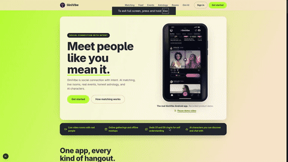

# GiniVibe-Project

A production-grade social media platform — responsive web app plus native Android and iOS apps, all served from a single monorepo.

[](https://www.typescriptlang.org/)
[](https://nextjs.org/)
[](https://expo.dev/)
[](https://www.postgresql.org/)
[](./frontend-app/LICENSE)

## Demo

<a href="https://youtu.be/JZLE3S9hWN8">
  
</a>

Preview loops above — click it to watch the full walkthrough with sound on YouTube.

## Overview

GiniVibe is a social discovery and community platform that brings together a multimedia feed, private messaging, online and offline events, group rooms, AI characters, astrology-based self-insight, and intelligent matching — in one cohesive product.

It is built as a service-oriented monorepo: a core API covering identity, feed, chat, presence, and search, plus focused microservices for events, matching, rooms, AI, astrology, and an enterprise ad network. PostgreSQL is the single source of truth across all of them, managed through Prisma and provisioned locally with Docker Compose.

There are two first-class clients:

- **Web** (`frontend-web/`) — Next.js 16 App Router dashboard, fully responsive down to phone widths.
- **Mobile** (`frontend-app/`) — Expo 57 + React Native app running on Android and iOS, with feature parity against the web client.

## Features

**Feed.** Chronological multimedia stream (text, images, video) with All / Images / Videos / Communities tabs, optimistic likes, threaded comments with ownership rules, native share, deduplicated view counts, community tagging, post creation with media upload, and natively injected sponsored placements from the built-in ad server.

**Messages.** Real-time 1:1 chat with message requests (pending / accept), live online presence, paginated history, conversation search over a privacy allowlist, and mute support. Client-side end-to-end encryption is on the roadmap; transport is secured today.

**Events.** Full discovery-to-RSVP loop. Online events carry a meeting URL and platform; offline events carry a venue and location. Status (live / upcoming / ended) is computed at query time, RSVPs (`interested / going / declined`) are duplicate-protected, and each user gets organized and attending hubs.

**Astrology.** Personality insight, not prediction: what suits a user's personality, what each house reflects, and where their strengths point. No future forecasting — the output feeds profiles and matching instead.

**Gini AI.** Chat with AI characters and create your own (persona, greeting, backstory) for others to discover. Persistent threads, markdown-rendered replies, and a character gallery, backed by a dedicated AI service.

**Rooms.** Group text, voice, and video spaces: create a room, invite people, talk live. Backed by a dedicated rooms service on top of the WebRTC realtime layer.

**Matching.** Personalized matching on interests and intent signals, astrology-based compatibility, and custom filters (age, city, interests, languages). This is being extended into natural-language AI search — e.g. typing "I want to connect with a founder in Delhi" resolves intent, applies privacy filtering, and returns ranked people instead of making users assemble filter combinations.

## Clients

**Web — `frontend-web/`**

Next.js 16 (App Router), React 19, Tailwind CSS 4. Route groups keep the consumer app, B2B enterprise dashboard, and admin portal strictly separated. Global presence runs over a single socket held in a Zustand store. Layouts adapt from desktop grids to phone-width navigation without a separate mobile site.

**Mobile — `frontend-app/`**

Expo 57, React Native, expo-router with file-based routes (`(auth)`, `(tabs)`, `chat`, `events`, `rooms`). Reanimated transitions, BlurView glass surfaces, Skia and Lottie artwork, `expo-image` / `expo-video` / `expo-image-picker`, haptics, safe-area-aware layouts, and token sessions persisted with AsyncStorage. Run paths: `npx expo start`, then `a` for Android, `i` for iOS, or scan the QR code with Expo Go. Same backend, same auth tokens, same realtime channels as web.

## Repository structure

Folder-level map. Each service directory contains its own README with file-level detail.

```
Ginivibe-project/
├── backend/
│   ├── monolithic/           core API: auth, feed, chat, presence, search (port 3001)
│   └── microservices/
│       ├── astrology/        personality-insight engine (port 3006)
│       ├── enterprise/       B2B ads, billing, admin control plane (port 3005)
│       ├── events-service/   events CRUD and RSVP service (port 3002)
│       ├── Gini_AI/          AI characters and roleplay (port 3004)
│       ├── live-matching/    WebRTC signaling, no database dependency (port 8080)
│       ├── non-live-matching/ offline and algorithmic matching (port 3003)
│       └── rooms-service/    group text, voice, and video rooms (port 3007)
├── db/                       Docker Compose setup, backup and restore scripts
├── frontend-app/             Expo React Native app for Android and iOS (port 8081)
│   └── src/
│       ├── app/              expo-router routes
│       ├── components/
│       ├── constants/
│       ├── features/
│       └── hooks/
├── frontend-web/             Next.js responsive dashboard (port 3000)
│   ├── app/                  (auth), (dashboard), (admin-portal), enterprise-dashboard
│   ├── components/
│   ├── hooks/
│   ├── lib/
│   ├── microservices/
│   ├── public/
│   ├── registry/
│   ├── styles/
│   └── types/
└── images/                   static showcase assets
```

Further reading: `ARCHITECTURE.md` (system design and onboarding), `FEED_SYSTEM.md`, `EVENTS_IMPLEMENTATION_COMPLETE.md`, `LIVE_MATCHING.md`, `NON_LIVE_MATCHING.md`, `ADS_SYSTEM.md`, `ADMIN_CONTROL_PLANE.md`, `ENTERPRISE.md`.

## Tech stack

| Layer | Choices |
|---|---|
| Web | Next.js 16, React 19, Tailwind CSS 4, Motion, Zustand, socket.io-client, LiveKit client |
| Mobile | Expo 57, React Native 0.86, expo-router, Reanimated, Skia, Lottie, AsyncStorage |
| Backend | Node.js 20+, Express 5, Socket.io, `ws`, Zod validation |
| Data | PostgreSQL 16 via Docker, Prisma ORM |
| Realtime | WebRTC peer-to-peer video with `ws` signaling; Socket.io presence |
| Media | Azure Blob uploads; expo-image / expo-video pipelines |
| Infra | Docker Compose for local databases; per-service `npm run dev` |

## Running locally

Prerequisites: Node.js 18 or higher (20+ recommended), Docker, Git. For mobile: an Android emulator, an iOS simulator, or the Expo Go app on a phone.

Start the database:

```bash
cd db
docker compose up -d
cd ../backend/monolithic
npx prisma db push
```

Start the backends (one terminal each):

```bash
# Core API: auth, feed, chat, presence, search (port 3001)
cd backend/monolithic && npm install && npm run dev

# Events (3002), non-live matching (3003), Gini AI (3004)
cd backend/microservices/events-service && npm install && npm run dev
cd backend/microservices/non-live-matching && npm install && npm run dev
cd backend/microservices/Gini_AI && npm install && npm run dev

# Enterprise ads and admin (3005), astrology (3006), rooms (3007)
cd backend/microservices/enterprise && npm install && npm run dev
cd backend/microservices/astrology && npm install && npm run dev
cd backend/microservices/rooms-service && npm install && npm run dev

# Live-matching WebRTC signaling (port 8080)
cd backend/microservices/live-matching && npm install && npm run dev
```

Start the frontends:

```bash
# Web dashboard (port 3000)
cd frontend-web && npm install && npm run dev

# Mobile (port 8081)
cd frontend-app && npm install && npx expo start
```

Copy each service's `.env.example` (or `.env.sample`) to `.env` and set `DATABASE_URL` and `JWT_SECRET` locally. Never commit `.env` files. The mobile app must point at your machine's LAN IP (e.g. `EXPO_PUBLIC_API_URL=http://192.168.x.x:3001`), not `localhost`.

Optional demo content:

```bash
cd backend/monolithic
npx tsx src/seed_feed.ts
```

## Roadmap

- Natural-language AI matching ("connect me with a founder in Delhi") across clients
- Client-side end-to-end encrypted messaging with device-held keys
- Push and in-app notifications for events, requests, and rooms
- Maps for offline events, iCalendar export, organizer analytics
- Streamed ad telemetry and Redis-backed presence for horizontal scale
- Native WebRTC bindings on mobile (currently a WebView bridge for V1)

## Contributing

Branch off `main` (`feat/...`, `fix/...`), open a pull request, and get a review before merging. Keep diffs scoped to one service per PR. `ARCHITECTURE.md` has a "Where do I make this change?" map — check it before touching shared code.

## License

See `frontend-app/LICENSE`. All rights reserved unless stated otherwise in a service directory.
