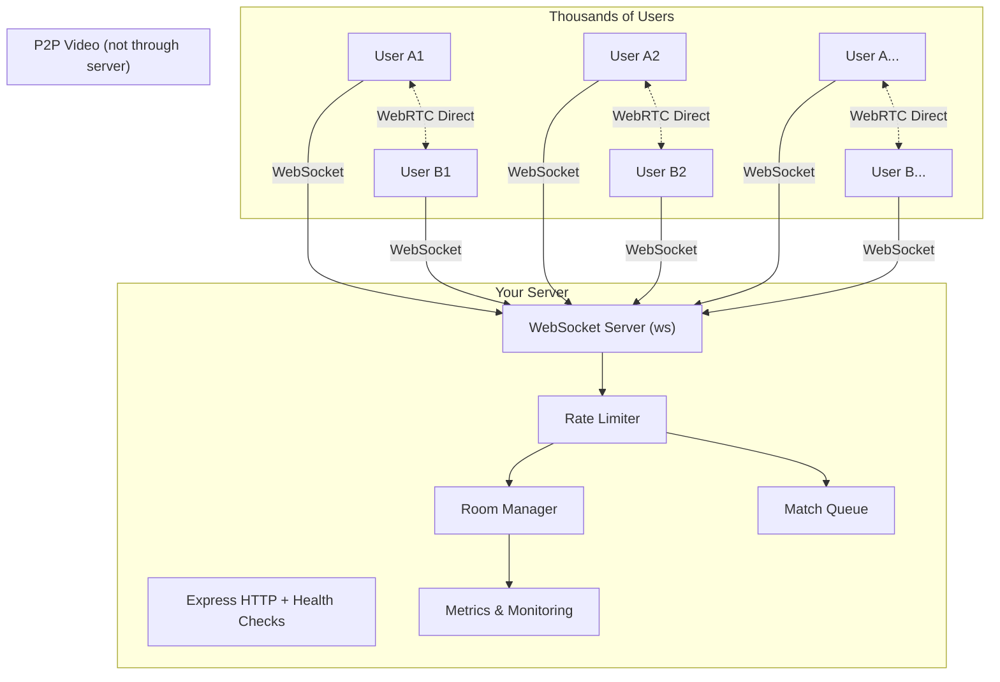

# Self-Hosted Video Calling Backend (Production-Grade)

Build a production-ready, self-hosted video calling system. **1-on-1 calls only**, but capable of handling **thousands of concurrent pairs** — like WhatsApp. All JavaScript/Node.js.

## Architecture



> [!IMPORTANT]
> **Your server only handles signaling** (tiny JSON messages). The actual video/audio goes peer-to-peer between users. So even with 10,000 concurrent calls, your server bandwidth stays minimal — it's just relaying small text messages to help peers connect.

## Production Considerations

| Concern | Solution |
|---|---|
| **Thousands of concurrent connections** | `ws` library handles 50K+ concurrent WebSocket connections on a single Node.js process |
| **Memory efficiency** | Rooms stored in `Map` (O(1) lookup), auto-cleanup on disconnect, no memory leaks |
| **Connection management** | Heartbeat ping/pong every 30s, dead connection cleanup, graceful shutdown with `SIGTERM` |
| **Rate limiting** | Per-IP connection limits, message rate limiting to prevent abuse |
| **Error resilience** | Uncaught exception handlers, connection error recovery, room state consistency |
| **Monitoring** | `/health` and `/metrics` endpoints — active rooms, connections, queue size, memory usage |
| **Security** | Origin validation, message size limits, input sanitization |
| **Horizontal scaling (future)** | Architecture ready for Redis pub/sub adapter when you need multiple server instances |
| **Logging** | Structured JSON logging with levels (info/warn/error) for production debugging |

## Proposed Changes

### Core Server

#### [NEW] [package.json](file:///home/rohit/DOCUMENTS/coding/live/video-call-server/package.json)
- Dependencies: `ws`, `express`, `uuid`, `cors`
- Dev dependencies: `nodemon`
- Scripts: `start`, `dev`

#### [NEW] [.env.example](file:///home/rohit/DOCUMENTS/coding/live/video-call-server/.env.example)
- `PORT` — HTTP/WS port (default 8080)
- `MAX_CONNECTIONS_PER_IP` — rate limit (default 5)
- `MESSAGE_RATE_LIMIT` — messages per second per client (default 20)
- `HEARTBEAT_INTERVAL` — ping interval in ms (default 30000)
- `STUN_SERVERS` — comma-separated STUN server URLs
- `LOG_LEVEL` — info/warn/error

#### [NEW] [server.js](file:///home/rohit/DOCUMENTS/coding/live/video-call-server/server.js)
Main entry point:
- Express HTTP server + WebSocket upgrade
- Health check (`/health`) and metrics (`/metrics`) endpoints
- Graceful shutdown on SIGTERM/SIGINT
- Structured logging

#### [NEW] [src/wsHandler.js](file:///home/rohit/DOCUMENTS/coding/live/video-call-server/src/wsHandler.js)
WebSocket connection handler:
- Per-connection state management (userId, roomId, IP)
- Message routing to appropriate handlers
- Rate limiting per client (token bucket)
- Heartbeat ping/pong with dead connection detection
- Clean disconnect handling

#### [NEW] [src/roomManager.js](file:///home/rohit/DOCUMENTS/coding/live/video-call-server/src/roomManager.js)
Production room management:
- `Map`-based storage for O(1) operations
- Strict 2-person limit per room
- Auto-cleanup when either peer disconnects
- Room creation with unique codes
- Stats reporting (active rooms count)

#### [NEW] [src/matchQueue.js](file:///home/rohit/DOCUMENTS/coding/live/video-call-server/src/matchQueue.js)
Matching queue:
- FIFO queue for fair matching
- Auto-match when 2 users are waiting
- Remove from queue on disconnect
- Queue timeout (configurable)
- Stats reporting (queue size)

#### [NEW] [src/signaling.js](file:///home/rohit/DOCUMENTS/coding/live/video-call-server/src/signaling.js)
WebRTC signaling relay:
- Forward SDP offers/answers between matched peers
- Forward ICE candidates between matched peers
- Validate message format before forwarding
- Handle renegotiation

#### [NEW] [src/rateLimiter.js](file:///home/rohit/DOCUMENTS/coding/live/video-call-server/src/rateLimiter.js)
Rate limiting:
- Per-IP connection limiting
- Per-client message rate limiting (token bucket algorithm)
- Configurable limits via environment variables

#### [NEW] [src/logger.js](file:///home/rohit/DOCUMENTS/coding/live/video-call-server/src/logger.js)
Structured JSON logger:
- Log levels: info, warn, error
- Timestamps, request IDs
- Safe for production (no sensitive data logging)

---

### Client Library

#### [NEW] [client/VideoCallClient.js](file:///home/rohit/DOCUMENTS/coding/live/video-call-server/client/VideoCallClient.js)
Reusable browser-side client class:
- Connect to signaling server
- WebRTC peer connection management
- Camera/microphone access via `getUserMedia`
- SDP offer/answer exchange
- ICE candidate handling
- Event-driven API: `onMatched`, `onRemoteStream`, `onCallEnded`, `onError`
- Controls: `toggleAudio()`, `toggleVideo()`, `endCall()`
- Auto-reconnect on signaling server disconnect
- STUN/TURN configuration

---

### Test Frontend

#### [NEW] [client/index.html](file:///home/rohit/DOCUMENTS/coding/live/video-call-server/client/index.html)
Production-quality test page:
- Dark theme with glassmorphism
- Local + remote video displays
- "Find Match" (random queue) + "Join Room" (code-based)
- Call controls: mute, camera off, end call
- Connection status + quality indicator
- Responsive layout

---

### Documentation

#### [NEW] [README.md](file:///home/rohit/DOCUMENTS/coding/live/video-call-server/README.md)
- Quick start guide
- Architecture diagram
- API documentation
- Next.js integration code examples
- Production deployment guide (PM2, Docker, Nginx reverse proxy)
- TURN server setup with coturn

## WebSocket Protocol

```
Client → Server:
  { type: "join-queue" }                          // Join random matching
  { type: "leave-queue" }                         // Leave queue
  { type: "create-room" }                         // Create room, get code back
  { type: "join-room", roomCode: "ABC123" }       // Join by code
  { type: "offer", sdp: "..." }                   // SDP offer → forwarded to peer
  { type: "answer", sdp: "..." }                  // SDP answer → forwarded to peer
  { type: "ice-candidate", candidate: "..." }     // ICE candidate → forwarded to peer
  { type: "end-call" }                            // End the call

Server → Client:
  { type: "matched", roomCode: "...", isInitiator: true/false }
  { type: "offer", sdp: "..." }
  { type: "answer", sdp: "..." }
  { type: "ice-candidate", candidate: "..." }
  { type: "peer-disconnected" }
  { type: "room-created", roomCode: "ABC123" }
  { type: "error", message: "..." }
  { type: "queue-position", position: 5 }
```

## Verification Plan

### Automated
```bash
cd video-call-server && npm start
curl http://localhost:8080/health    # Should return { status: "ok" }
curl http://localhost:8080/metrics   # Should return stats
```

### Manual
1. Open test page in **2 browser tabs** (different browsers for best test)
2. Click "Find Match" in both → verify video call connects
3. Test mute, camera off, end call
4. Test room-code matching
5. Close one tab → verify other gets notified
6. Open 10+ tabs and match in pairs → verify concurrent calls work
